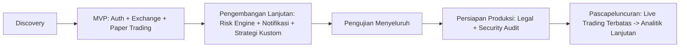

# PRD — Product Requirements Document
## Platform Trading Kripto Terpadu ("Nexa Trade" — nama kerja/placeholder)

> Dokumen ini disusun berdasarkan riset kompetitor terhadap MoonBot (moonbot.id) dan AIO Trade (aiotrade.co). Lihat catatan status pada setiap bagian: `CONFIRMED`, `RESEARCHED`, `PROPOSED`, `TBD`, `BLOCKED`. Dokumen ini **tidak** mengasumsikan seluruh fitur MoonBot/AIO Trade harus dibangun, dan tidak mereplikasi kode atau aset visual milik pihak mana pun.

---

## 1. Informasi Dokumen

| Field | Nilai |
|---|---|
| Nama Produk | Nexa Trade (nama kerja — `TBD` menunggu keputusan merek & pengecekan merek dagang) |
| Nama Proyek | Platform Trading Kripto Terpadu |
| Nomor Versi Dokumen | 1.0 |
| Status Dokumen | DRAFT — menunggu review Product Owner |
| Tanggal Penyusunan | 22 September 2026 |
| Pemilik Produk | `TBD` |
| Penulis Dokumen | Tim Riset & Produk (disusun via asisten AI berdasarkan riset kompetitor) |
| Riwayat Perubahan | v1.0 — Draf awal berdasarkan hasil riset MoonBot & AIO Trade |
| Daftar Kontributor | `TBD` |
| Daftar Persetujuan | `TBD` — belum ada tanda tangan/approval |
| Status Validasi Kebutuhan | Sebagian besar `RESEARCHED`/`PROPOSED`; belum ada validasi pengguna nyata (lihat Bagian 9) |

### Riwayat Perubahan (Changelog)

| Versi | Tanggal | Perubahan | Penulis |
|---|---|---|---|
| 1.0 | 2026-09-22 | Draf awal | Tim Riset & Produk |

---

## 2. Ringkasan Produk

### 2.1 Gambaran Umum
Nexa Trade adalah platform web (dengan dukungan mobile) yang memungkinkan pengguna menghubungkan akun exchange kripto miliknya (via API key) dan menjalankan strategi trading otomatis (bot) secara terkendali — dimulai dari mode **paper trading** (simulasi tanpa dana riil) sebelum opsional beralih ke **live trading** (dana riil) pada fase lanjutan. **[PROPOSED]**

### 2.2 Visi Produk
Menjadi platform Expert Advisor kripto di Indonesia yang **transparan, aman, dan patuh regulasi**, di mana pengguna memahami risiko sebelum menggunakan modal riil. **[PROPOSED]**

### 2.3 Misi Produk
- Menyediakan alat otomasi trading yang mudah dipahami investor ritel Indonesia. **[PROPOSED]**
- Mengutamakan edukasi dan simulasi (paper trading) sebelum eksekusi dana riil. **[PROPOSED]**
- Membangun kepercayaan melalui keamanan API key, audit log, dan kejelasan model bisnis (bukan skema lisensi yang membingungkan). **[PROPOSED, berdasarkan pelajaran dari Bagian 11 laporan riset — skema kupon durasi ekstrem MoonBot sebaiknya tidak ditiru]**

### 2.4 Tujuan Bisnis
- `TBD` — target akuisisi pengguna, target pendapatan, dan model monetisasi final belum ditetapkan oleh pemilik produk.
- Model bisnis kandidat: langganan berkala (bulanan/tahunan) dan/atau performance fee. **[PROPOSED]**

### 2.5 Masalah Pengguna yang Ingin Diselesaikan
- Investor ritel kripto tidak punya waktu/keahlian memantau pasar 24/7. **[RESEARCHED — konteks industri, sumber: artikel pers MoonBot/PT MUN 2023]**
- Banyak pengguna terjebak platform "robot trading" tanpa transparansi dan tanpa mekanisme pembelajaran bertahap, yang berkontribusi pada kasus penipuan berulang di Indonesia (MarkAI, Fahrenheit, Evotrade, dll.). **[RESEARCHED — lihat laporan riset Bagian 11]**
- Tidak ada standar mode uji coba (paper trading) yang konsisten sebelum pengguna mempertaruhkan dana riil di kompetitor yang diriset. **[RESEARCHED — tidak ditemukan bukti fitur ini di MoonBot maupun AIO Trade]**

### 2.6 Nilai yang Ditawarkan
1. Onboarding bertahap dengan paper trading wajib sebelum live trading. **[PROPOSED]**
2. Transparansi model bisnis dan biaya. **[PROPOSED]**
3. Keamanan API key tingkat tinggi (trade-only permission, enkripsi, audit log). **[PROPOSED]**
4. Manajemen risiko otomatis yang dapat dikonfigurasi pengguna. **[PROPOSED]**

### 2.7 Ruang Lingkup Produk
**Masuk ruang lingkup v1 (usulan):**
- Autentikasi & manajemen akun.
- Integrasi API exchange (minimal 1 exchange spot, contoh kandidat: Binance).
- Dashboard portofolio & saldo.
- Strategy engine dasar (indikator teknikal umum).
- Paper trading engine (wajib, sebelum live trading dibuka).
- Manajemen risiko dasar (stop-loss/limit sederhana).
- Notifikasi (minimal 1 kanal, contoh kandidat: Telegram/email).
- Riwayat transaksi & laporan performa dasar.

**Di luar ruang lingkup v1 (eksplisit ditunda — `PROPOSED`, menunggu keputusan Product Owner):**
- Futures trading.
- Multi-exchange lebih dari 1-2 exchange.
- Live trading dengan dana riil (dibuka setelah paper trading stabil & lolos audit keamanan — lihat Bagian 6).
- Sistem referral/afiliasi.
- Aplikasi mobile native (web responsif dulu).

### 2.8 Batasan Produk
- Produk **bukan** exchange — tidak mengkustodi dana pengguna secara langsung; dana tetap di exchange pihak ketiga, diakses via API key bertipe trade-only. **[PROPOSED, prinsip keamanan]**
- Produk tidak memberikan nasihat investasi finansial personal; sinyal/strategi adalah alat, bukan jaminan keuntungan. **[PROPOSED]**
- Status hukum dan perizinan (Bappebti/OJK) untuk beroperasi sebagai penasihat berjangka/expert advisor di Indonesia **belum dikonfirmasi — `BLOCKED`, memerlukan konsultasi hukum** sebelum fitur live trading diaktifkan untuk publik (lihat laporan riset Bagian 11).

### 2.9 Perbedaan Fitur Hasil Riset vs. Fitur yang Akan Dibangun
| Fitur | Ditemukan di riset? | Akan dibangun di v1? | Keterangan |
|---|---|---|---|
| Koneksi API multi-exchange | Ya (MoonBot: Binance, Tokocrypto, OKX) `CONFIRMED` di kompetitor | Ya, mulai 1 exchange | Diperluas bertahap |
| Sistem kupon berjenjang durasi tahun (1/7/200 th) | Ya (MoonBot) `CONFIRMED` di kompetitor | **Tidak** | Diganti model langganan lazim — lihat Bagian 11 riset |
| Paper trading | Tidak ditemukan di kedua kompetitor | Ya, wajib | Usulan baru berbasis best practice |
| Grid/DCA trading | Tidak dapat diverifikasi di kedua kompetitor | `TBD` — kandidat fase 2 | Menunggu riset strategi lebih lanjut |
| Fitur AIO Trade secara umum | Tidak dapat diverifikasi (akses tertutup) | Tidak diadopsi langsung | Tidak ada dasar bukti untuk direplikasi |

---

## 3. Target Pengguna dan User Persona

> Persona dibatasi hanya pada peran yang relevan dengan ruang lingkup v1. Peran seperti "operator sistem" digabung ke Administrator karena tim masih kecil di tahap awal. **[PROPOSED]**

### 3.1 Persona: Pemula (Rian, 27 tahun)
- **Profil umum:** Baru mengenal kripto, belum pernah trading otomatis.
- **Tujuan:** Mencoba trading otomatis tanpa risiko kehilangan uang di awal.
- **Kebutuhan:** Panduan onboarding jelas, mode simulasi, penjelasan risiko dalam bahasa sederhana.
- **Masalah:** Takut kehilangan uang karena tidak paham cara kerja bot.
- **Tingkat pengetahuan teknis:** Rendah.
- **Hambatan penggunaan:** Istilah teknis trading (RSI, MACD, dll.) belum familiar.
- **Skenario penggunaan:** Mendaftar, menyelesaikan tutorial singkat, menjalankan paper trading 1-2 minggu sebelum mempertimbangkan modal riil.

### 3.2 Persona: Trader Berpengalaman (Dewi, 35 tahun)
- **Profil umum:** Sudah trading manual kripto 2+ tahun, familiar dengan indikator teknikal.
- **Tujuan:** Mengotomatisasi strategi yang sudah dikuasainya agar bisa berjalan 24/7.
- **Kebutuhan:** Kustomisasi strategi/parameter indikator, kontrol risiko granular, laporan performa detail.
- **Masalah:** Platform kompetitor sering "kotak hitam" (tidak transparan cara kerja strategi).
- **Tingkat pengetahuan teknis:** Tinggi (soal trading), sedang (soal teknologi).
- **Hambatan penggunaan:** Enggan memakai platform tanpa kontrol/parameter yang cukup rinci.
- **Skenario penggunaan:** Menghubungkan API key, membangun konfigurasi strategi kustom, memantau lewat dashboard analitik lanjutan.

### 3.3 Persona: Pengguna Paper Trading (segmen lintas-persona)
- Bukan grup usia/latar belakang tertentu, melainkan **status penggunaan**: setiap pengguna baru wajib melalui mode ini sebelum live trading diaktifkan. **[PROPOSED — business rule, lihat SRS BR-TRADE-001]**

### 3.4 Persona: Administrator (Tim Internal)
- **Profil umum:** Staf internal produk yang mengelola pengguna, memantau sistem, dan menangani dukungan pelanggan.
- **Tujuan:** Memastikan sistem berjalan sehat, menangani keluhan, memantau aktivitas mencurigakan.
- **Kebutuhan:** Panel admin dengan kontrol pengguna, log audit, dan alat monitoring.
- **Tingkat pengetahuan teknis:** Tinggi.
- **Skenario penggunaan:** Meninjau log audit saat ada laporan sengketa transaksi; menonaktifkan akun yang mencurigakan.

**Persona yang secara sengaja tidak dibuat pada v1** (karena di luar ruang lingkup): pengguna futures trading, pengguna afiliasi/referral, pengguna multi-tenant institusional. **[PROPOSED]**

---

## 4. User Stories dan Use Cases

### 4.1 Contoh User Stories

| ID | User Story | Acceptance Criteria (ringkas) | Prioritas | Dependensi | Status |
|---|---|---|---|---|---|
| US-001 | Sebagai pengguna baru, saya ingin mendaftar dengan email/nomor telepon, sehingga saya bisa mulai menggunakan platform. | Registrasi berhasil dengan verifikasi OTP; akun tidak aktif sebelum verifikasi selesai. | Must Have | - | PROPOSED |
| US-002 | Sebagai pengguna, saya ingin menghubungkan API key exchange saya, sehingga bot dapat membaca data/eksekusi order atas nama saya. | API key divalidasi (test call) sebelum disimpan; key disimpan terenkripsi; hanya izin trade-only yang diterima. | Must Have | US-001 | PROPOSED |
| US-003 | Sebagai pengguna pemula, saya ingin mencoba strategi di mode paper trading, sehingga saya bisa belajar tanpa risiko dana riil. | Saldo simulasi diberikan; order paper trading tidak pernah menyentuh exchange sungguhan. | Must Have | US-002 | PROPOSED |
| US-004 | Sebagai trader berpengalaman, saya ingin mengatur parameter indikator strategi saya, sehingga bot berjalan sesuai gaya trading saya. | Form konfigurasi strategi tervalidasi; parameter di luar batas wajar ditolak dengan pesan jelas. | Should Have | US-002 | PROPOSED |
| US-005 | Sebagai pengguna, saya ingin mengatur batas risiko (stop-loss global), sehingga kerugian saya terbatas otomatis. | Order yang melanggar batas risiko ditolak sebelum eksekusi. | Must Have | US-004 | PROPOSED |
| US-006 | Sebagai pengguna, saya ingin menerima notifikasi saat order tereksekusi atau bot berhenti, sehingga saya selalu tahu status akun saya. | Notifikasi terkirim dalam <60 detik dari event terjadi (target awal, `TBD` perlu validasi kapasitas). | Should Have | US-002 | PROPOSED |
| US-007 | Sebagai administrator, saya ingin melihat log audit aktivitas pengguna, sehingga saya bisa menyelidiki sengketa. | Log mencatat aktor, waktu, dan aksi; tidak dapat diedit/dihapus manual. | Must Have | - | PROPOSED |
| US-008 | Sebagai pengguna, saya ingin menghentikan bot kapan saja, sehingga saya tetap punya kendali penuh. | Perintah stop dieksekusi dalam waktu singkat (`TBD` target SLA); order yang sedang berjalan diselesaikan atau dibatalkan sesuai kebijakan yang jelas ke pengguna. | Must Have | US-002 | PROPOSED |

### 4.2 Use Case Terperinci (Contoh: Integrasi Exchange)

**UC-002: Integrasi Exchange**
- **Aktor:** Pengguna terautentikasi.
- **Prasyarat:** Akun sudah terverifikasi (OTP selesai).
- **Alur utama:**
  1. Pengguna membuka halaman "Koneksi Exchange".
  2. Pengguna memilih exchange dari daftar yang didukung.
  3. Pengguna memasukkan API key & secret.
  4. Sistem melakukan test call ke exchange (misalnya cek saldo) untuk memvalidasi key dan memastikan izin bersifat trade-only (bukan withdrawal).
  5. Jika valid, sistem menyimpan key terenkripsi dan menampilkan status "Terhubung".
- **Alur alternatif:** Pengguna memasukkan key dengan izin withdrawal aktif → sistem menolak dan meminta pengguna membuat key baru dengan izin terbatas.
- **Kondisi kesalahan:** Key tidak valid/kedaluwarsa → pesan error jelas + tautan bantuan cara membuat API key exchange terkait.
- **Status:** PROPOSED

**Daftar use case lain yang perlu dibuat detail serupa sebelum implementasi (`TBD`, disiapkan tim BA):** Pendaftaran, Login, Pengaturan Keamanan (2FA), Pengelolaan API Key (edit/hapus), Melihat Data Pasar, Membuat Konfigurasi Bot, Menjalankan Paper Trading, Menghentikan Bot, Melihat Posisi & Saldo Simulasi, Melihat Riwayat Transaksi, Melihat Laporan Performa, Mengatur Notifikasi, Pengelolaan Pengguna oleh Administrator.

---

## 5. Daftar Fitur Produk

| ID | Modul | Fitur | Deskripsi | Nilai bagi Pengguna | Prioritas | Status |
|---|---|---|---|---|---|---|
| F-AUTH-01 | Authentication & Authorization | Registrasi & Login | Registrasi email/telepon + OTP, login dengan password | Akses aman ke akun | Must Have | PROPOSED |
| F-AUTH-02 | Authentication & Authorization | 2FA | Autentikasi dua faktor untuk aksi sensitif | Keamanan akun lebih tinggi | Should Have | PROPOSED |
| F-USER-01 | User Management | Profil Pengguna | Kelola data profil dasar | Personalisasi akun | Must Have | PROPOSED |
| F-DASH-01 | Dashboard | Ringkasan Saldo & Portofolio | Tampilan saldo per-exchange, total aset | Visibilitas kondisi akun | Must Have | PROPOSED |
| F-MKT-01 | Market Data | Tampilan Harga & Candle | Grafik harga real-time/candle | Dasar pengambilan keputusan | Must Have | PROPOSED |
| F-EXC-01 | Exchange Integration | Koneksi API Exchange | Hubungkan akun exchange via API key | Bot dapat beroperasi atas nama pengguna | Must Have | PROPOSED |
| F-STRAT-01 | Strategy Management | Pemilihan Strategi Dasar | Pilih dari daftar strategi berbasis indikator umum | Trading otomatis tanpa coding | Must Have | PROPOSED |
| F-STRAT-02 | Strategy Management | Kustomisasi Parameter Strategi | Atur parameter indikator | Fleksibilitas untuk trader berpengalaman | Should Have | PROPOSED |
| F-BOT-01 | Bot Management | Lifecycle Bot (create/start/stop/delete) | Kelola siklus hidup bot | Kontrol penuh atas otomasi | Must Have | PROPOSED |
| F-PAPER-01 | Paper Trading | Mode Simulasi | Trading tanpa dana riil dengan saldo virtual | Belajar tanpa risiko | Must Have | PROPOSED |
| F-PORT-01 | Portfolio Management | Riwayat & Laporan Posisi | Lihat posisi terbuka/tertutup | Transparansi performa | Must Have | PROPOSED |
| F-ORD-01 | Order Management | Riwayat Order | Daftar seluruh order (paper & live) | Audit pribadi | Must Have | PROPOSED |
| F-RISK-01 | Risk Management | Stop-Loss Global | Batas kerugian otomatis per bot/akun | Perlindungan modal | Must Have | PROPOSED |
| F-RISK-02 | Risk Management | Circuit Breaker | Hentikan seluruh trading otomatis saat volatilitas ekstrem | Perlindungan sistemik | Should Have | PROPOSED |
| F-AN-01 | Analytics & Reporting | Laporan PnL | Ringkasan untung/rugi per periode | Evaluasi performa | Must Have | PROPOSED |
| F-NOTIF-01 | Notification | Notifikasi Telegram/Email | Info order, error, status bot | Kesadaran real-time | Should Have | PROPOSED |
| F-SUB-01 | Subscription | Paket Langganan | Model harga berbasis langganan (bukan kupon durasi ekstrem) | Kejelasan biaya | Should Have | PROPOSED |
| F-ADM-01 | Administration | Panel Admin Pengguna | Kelola akun pengguna | Operasional tim internal | Must Have | PROPOSED |
| F-MON-01 | System Monitoring | Dashboard Kesehatan Sistem | Pantau uptime, error rate | Keandalan operasional | Should Have | PROPOSED |
| F-SEC-01 | Audit & Security | Audit Log | Catatan seluruh aksi sensitif | Kepatuhan & investigasi sengketa | Must Have | PROPOSED |

**Catatan:** Tidak seluruh modul di atas wajib masuk MVP — lihat Bagian 6 untuk pemetaan prioritas terhadap tahap roadmap.

---

## 6. Prioritas Fitur dan Roadmap Produk

### 6.1 Kerangka Prioritas (MoSCoW)

- **Must Have (wajib untuk MVP dapat digunakan dengan aman):** F-AUTH-01, F-USER-01, F-DASH-01, F-MKT-01, F-EXC-01, F-STRAT-01, F-BOT-01, F-PAPER-01, F-PORT-01, F-ORD-01, F-RISK-01, F-AN-01, F-ADM-01, F-SEC-01.
  *Alasan:* Tanpa fitur ini, produk tidak bisa dipakai secara fungsional maupun aman (paper trading & risk management wajib demi keselamatan finansial pengguna, sesuai pelajaran dari kasus penipuan robot-trading di Bagian 11 laporan riset).
- **Should Have (penting tapi bisa menyusul segera setelah MVP):** F-AUTH-02 (2FA), F-STRAT-02, F-RISK-02, F-NOTIF-01, F-SUB-01, F-MON-01.
  *Alasan:* Meningkatkan keamanan dan pengalaman, namun MVP tetap bisa berjalan minimal tanpanya untuk kelompok uji terbatas.
- **Could Have (nilai tambah, fase lanjutan):** Multi-exchange lebih luas, strategi grid/DCA, laporan analitik lanjutan (win rate, drawdown ratio).
- **Won't Have for Now:** Futures trading, sistem referral/afiliasi, live trading terbuka untuk publik luas (ditunda hingga kepatuhan hukum & audit keamanan selesai — `BLOCKED`).

### 6.2 Roadmap Produk (tanpa estimasi waktu pasti — lihat catatan)

- **Discovery:** Validasi kebutuhan dengan calon pengguna nyata, finalisasi keputusan hukum awal. `PROPOSED`
- **MVP:** Modul must-have di atas, seluruhnya dalam mode paper trading (live trading belum dibuka). `PROPOSED`
- **Pengembangan Lanjutan:** Modul should-have + evaluasi kesiapan live trading. `PROPOSED`
- **Pengujian:** Lihat SRS Bagian 4.10 dan SDD Bagian 13. `PROPOSED`
- **Persiapan Produksi:** Live trading **tidak** dibuka sebelum status hukum jelas (`BLOCKED` — lihat Bagian 9). `BLOCKED`
- **Pascapeluncuran:** Iterasi berbasis data penggunaan nyata. `PROPOSED`

Catatan: Tidak ada estimasi tanggal/durasi yang diberikan karena belum ada data kapasitas tim yang dikonfirmasi — menetapkan tanggal tanpa dasar akan menyesatkan perencanaan. `TBD`

---

## 7. Persyaratan UX dan Desain Produk

> Karena tidak ada desain UI yang diserahkan bersama prompt ini, bagian ini berisi **kebutuhan**, bukan spesifikasi visual final. Jika UI/wireframe sudah dibuat di kemudian hari, dokumen ini harus diperbarui agar diselaraskan (bukan diabaikan), sesuai instruksi. `TBD`

- **Struktur navigasi:** Navigasi utama berbasis dashboard tunggal dengan modul: Beranda, Exchange, Strategi & Bot, Portofolio, Risiko, Analitik, Langganan, Bantuan — mengikuti konsep struktur navigasi pada laporan riset Bagian 7. `PROPOSED`
- **Informasi arsitektur:** Hierarki: Akun → Exchange terhubung → Bot per-exchange → Strategi per-bot. `PROPOSED`
- **Dashboard:** Ringkasan saldo, PnL harian, status bot aktif, notifikasi terbaru pada satu layar. `PROPOSED`
- **Layout halaman & Responsive design:** Wajib mobile-responsive (breakpoint mobile/tablet/desktop); prioritas web responsif dulu sebelum aplikasi native. `PROPOSED`
- **Aksesibilitas:** Kontras warna memadai (WCAG AA sebagai target awal), label form yang jelas untuk pembaca layar. `PROPOSED — target perlu divalidasi tim desain`
- **Empty states:** Pesan panduan saat belum ada bot/exchange terhubung (mis. "Hubungkan exchange pertama Anda untuk memulai"). `PROPOSED`
- **Loading states:** Skeleton loader untuk data dashboard, indikator progres saat validasi API key. `PROPOSED`
- **Error states:** Pesan error spesifik dan actionable (bukan generik "terjadi kesalahan"), terutama untuk kegagalan koneksi exchange. `PROPOSED`
- **Confirmation dialogs:** Wajib untuk aksi ireversibel: hapus API key, hentikan bot dengan posisi terbuka, upgrade dari paper ke live trading. `PROPOSED`
- **Onboarding:** Tur singkat + edukasi risiko sebelum pengguna dapat menghubungkan API key pertamanya. `PROPOSED`
- **Desain konfigurasi bot:** Form bertahap (wizard) — pilih exchange → pilih strategi → atur parameter risiko → review → aktivasi. `PROPOSED`
- **Pengalaman monitoring trading:** Update real-time (WebSocket) untuk saldo dan status order, bukan polling manual. `PROPOSED`

---

## 8. KPI dan Metrik Keberhasilan

| Metrik | Deskripsi | Jenis Target | Status |
|---|---|---|---|
| Tingkat penyelesaian onboarding | % pengguna baru yang menyelesaikan setup awal (registrasi → koneksi exchange → aktivasi bot paper trading) | Diusulkan >60% | PROPOSED, perlu baseline nyata |
| Tingkat keberhasilan konfigurasi bot | % percobaan konfigurasi bot yang berhasil tanpa error | Diusulkan >90% | PROPOSED |
| Stabilitas sistem (uptime) | % waktu sistem operasional | Diusulkan 99.5% | PROPOSED, target industri umum, belum divalidasi kapasitas tim |
| Waktu respons API | Latensi rata-rata endpoint kritis | Lihat SRS NFR-PERF | PROPOSED |
| Tingkat kegagalan order | % order yang gagal/timeout terhadap exchange | Diusulkan <1% | PROPOSED |
| Kualitas sinkronisasi data | Selisih waktu antara update harga exchange dan tampilan dashboard | Diusulkan <5 detik | PROPOSED |
| Penggunaan fitur | % pengguna aktif yang memakai fitur inti (bot, laporan) per bulan | Belum ada baseline | TBD |
| Keandalan notifikasi | % notifikasi terkirim vs. seharusnya terkirim | Diusulkan >99% | PROPOSED |

**Catatan penting:** Seluruh angka target di atas adalah **usulan awal**, belum disepakati Product Owner, dan belum divalidasi terhadap kapasitas infrastruktur nyata — ditandai `PROPOSED`, bukan `CONFIRMED`.

---

## 9. Risiko Produk dan Keputusan yang Belum Ditetapkan

### 9.1 Risiko Produk
- **Risiko regulasi:** Status izin Bappebti/OJK untuk beroperasi sebagai Expert Advisor di Indonesia belum dikonfirmasi. **`BLOCKED`** — live trading publik tidak boleh diluncurkan sebelum ini jelas.
- **Risiko reputasi:** Industri robot-trading Indonesia punya rekam jejak penipuan besar; kepercayaan pengguna harus dibangun lewat transparansi sejak awal. `RESEARCHED`
- **Risiko teknis:** Kegagalan trading engine/risk engine berdampak langsung pada dana pengguna (saat live trading dibuka). `PROPOSED — mitigasi lihat SDD Bagian 10`
- **Risiko operasional:** Ketergantungan pada uptime dan kebijakan API exchange pihak ketiga di luar kendali tim. `PROPOSED`
- **Risiko integrasi exchange:** Perubahan API exchange tanpa pemberitahuan dapat merusak fungsi bot. `PROPOSED`
- **Risiko penggunaan bot:** Pengguna dapat salah paham bahwa bot menjamin keuntungan. `PROPOSED — mitigasi: edukasi onboarding wajib`

### 9.2 Pertanyaan yang Masih Terbuka
1. Siapa Product Owner/pemilik keputusan final untuk dokumen ini? `TBD`
2. Apakah live trading akan dibuka di v1 atau ditunda total ke fase 2? `TBD`
3. Exchange mana yang menjadi prioritas integrasi pertama? `TBD`
4. Apakah model bisnis final adalah langganan, performance fee, atau kombinasi? `TBD`
5. Apakah badan hukum sudah/akan mengurus izin Bappebti sebelum peluncuran publik? `BLOCKED`

### 9.3 Keputusan yang Membutuhkan Persetujuan
- Nama produk final dan pengecekan merek dagang. `TBD`
- Cakupan exchange yang didukung di MVP. `TBD`
- Kebijakan kapan live trading dibuka ke publik (kriteria kelulusan keamanan & hukum). `BLOCKED`

---

*Dokumen ini adalah versi draf awal (v1.0) dan akan diperbarui seiring validasi kebutuhan nyata, keputusan Product Owner, dan hasil audit hukum/keamanan. Lihat SRS_Platform_Trading_Terpadu_v1.0.md dan SDD_Platform_Trading_Terpadu_v1.0.md untuk turunan teknis dokumen ini.*
