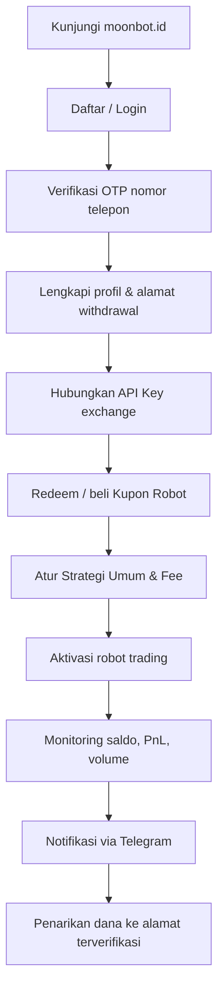
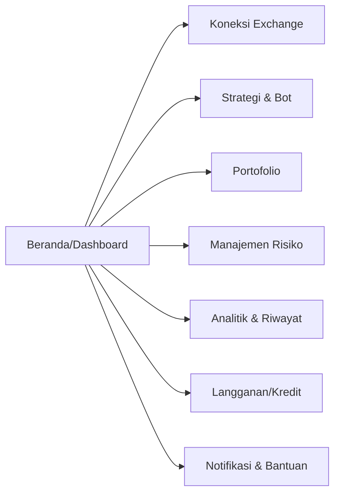
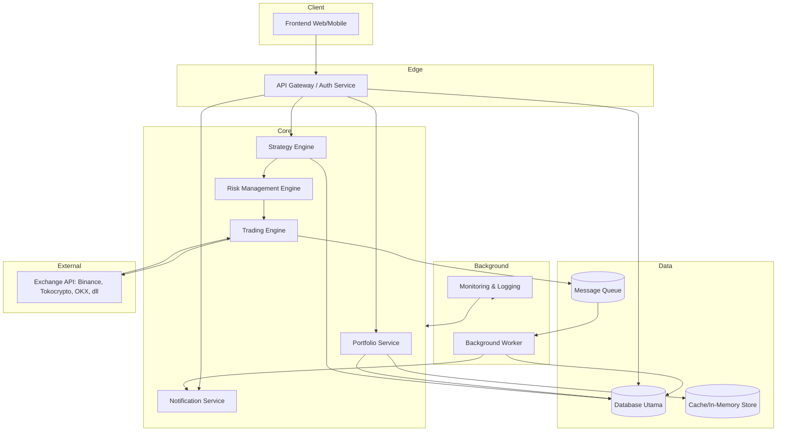
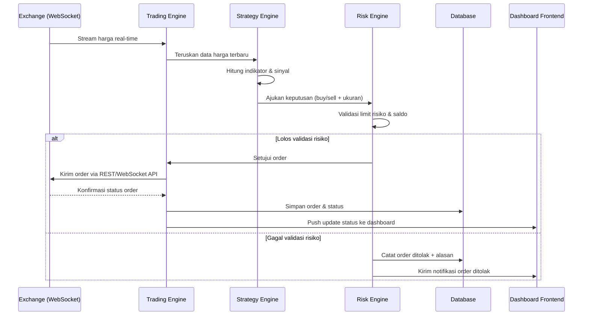
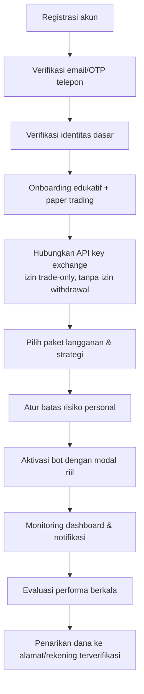

# Riset & Konsep Penggabungan Platform MoonBot × AIO Trade

2026-09-22 · @Someone

## 1. Ringkasan Eksekutif

Riset ini membandingkan dua platform robot-trading kripto asal Indonesia — **MoonBot** (moonbot.id, milik PT Maju Untuk Negeri/PT MUN) dan **AIO Trade** (aiotrade.co) — untuk menilai kelayakan menggabungkannya menjadi satu platform baru.

**Temuan kunci:**

- Kedua situs adalah *single-page application* (SPA) berbasis JavaScript. MoonBot teridentifikasi memakai **Vue.js** (pola `{{ $t('...') }}` dari `vue-i18n` terlihat jelas di markup mentah). AIO Trade praktis tidak mengekspos konten publik apa pun selain metadata PWA (`apple-mobile-web-app-capable`, tagline "The Real Money Machine") — hampir seluruh produknya berada di balik login.
- MoonBot memiliki **legalitas yang terverifikasi**: izin Penasihat Berjangka Bappebti No. 01/BAPPEBTI/SI-PNB/05/2023 dan izin Expert Advisor No. 01/BAPPEBTI/SP-PBEA/09/2023, dipegang oleh PT Maju Untuk Negeri. Situsnya juga menampilkan rujukan "SERTIFIKAT IZIN OTORITAS JASA KEUANGAN" (OJK) — ini perlu dibaca hati-hati karena OJK secara historis menyatakan aset kripto **bukan** produk berizin OJK (lihat Bagian 8 dan 14 untuk sumber).
- **Tidak ditemukan bukti publik yang cukup** mengenai badan hukum, izin Bappebti, atau entitas pengelola di balik AIO Trade. Ini bukan berarti tidak ada — hanya berarti tidak dapat diverifikasi lewat riset terbuka yang dilakukan di sini.
- Fitur MoonBot yang **terverifikasi dari markup publik**: koneksi API ke Binance, Tokocrypto, dan OKX; dashboard saldo per-exchange; volume trading; sistem kupon/voucher berjenjang (Basic/Advanced/Pro); notifikasi Telegram; halaman strategi umum; halaman pengaturan fee; halaman saving, bonus/cashback, dan riwayat profit; verifikasi OTP nomor telepon; alamat penarikan (withdrawal address) terverifikasi; serta dukungan aplikasi iOS/Android.
- Untuk AIO Trade, **tidak ada fitur yang dapat diverifikasi secara langsung** dari halaman publik karena kontennya dirender penuh oleh JavaScript di balik autentikasi. Setiap klaim fitur AIO Trade dalam riset ini murni bersumber dari nama domain, meta-tag, dan konteks umum industri robot-trading — bukan observasi langsung.
- Industri "robot trading" di Indonesia memiliki **rekam jejak risiko regulasi dan penipuan yang signifikan** (kasus MarkAI, Fahrenheit, Evotrade, Sunton Capital, Trade Gold 5.0, dll., dengan kerugian yang dilaporkan mencapai triliunan rupiah). Ini menjadi konteks penting untuk Bagian 8 (legalitas) dan harus menjadi perhatian utama sebelum membangun ulang model bisnis serupa.

**Rekomendasi inti:** Karena keterbatasan akses yang sangat besar ke AIO Trade dan risiko regulasi yang tinggi di sektor ini, laporan ini merekomendasikan pendekatan *concept-level* — mengadopsi pola fitur dan pelajaran UX yang lazim di kategori robot-trading kripto Indonesia, **bukan** mereplikasi kode atau desain spesifik dari salah satu situs — sambil menempatkan kepatuhan Bappebti/OJK dan keamanan API key sebagai prasyarat, bukan fitur tambahan.

## 2. Metodologi Penelitian

Riset dilakukan dengan tiga langkah:

1. **Fetch langsung** terhadap `https://moonbot.id/` dan `https://aiotrade.co/` untuk membaca markup HTML awal (pre-render) yang dikirim server, termasuk meta-tag, teks placeholder i18n, dan aset gambar yang dirujuk.
2. **Pencarian eksternal** (berita, direktori hukum, forum industri) untuk memverifikasi identitas badan hukum, izin regulator, dan konteks industri, karena dashboard kedua platform memerlukan login dan tidak dapat diakses tanpa akun.
3. **Analisis pola teknis** dari markup yang berhasil diambil (penanda framework, struktur PWA, pola template) — tanpa alat deteksi teknologi pihak ketiga seperti Wappalyzer/BuiltWith karena alat tersebut tidak tersedia dalam sesi ini; kesimpulan teknologi murni dari observasi markup dan pencarian web.

**Keterbatasan akses yang signifikan:**

- Kedua situs adalah SPA yang sebagian besar dirender oleh JavaScript di sisi klien. Alat fetch yang digunakan tidak mengeksekusi JavaScript penuh, sehingga hanya menangkap kerangka HTML/markup awal dan teks yang sudah ter-inline di source (termasuk potongan template Vue yang belum di-render, yang justru **membantu** mengidentifikasi Vue.js sebagai framework MoonBot).
- **MoonBot**: sebagian konten dashboard (yang tampaknya normalnya berada di balik login) ikut termuat di source publik dalam bentuk template (kemungkinan karena SPA memuat semua route di satu bundle). Ini memberi visibilitas tak terduga ke banyak elemen UI dan nama fitur, meski tanpa data pengguna nyata.
- **AIO Trade**: source yang berhasil diambil nyaris kosong — hanya metadata dasar (judul, deskripsi, tag PWA). Tidak ada rute, komponen, atau daftar fitur yang bisa diekstrak. Pencarian eksternal juga tidak menemukan artikel berita, ulasan, unggahan media sosial, atau catatan hukum yang secara spesifik membahas domain `aiotrade.co`. Akibatnya, **Bagian 4 laporan ini jauh lebih tipis dan lebih banyak berbasis inferensi/analogi industri dibanding Bagian 3**.
- Tidak ada percobaan login, scraping berbasis kredensial, atau bypass otentikasi yang dilakukan — sesuai batasan etis riset ini.

Sepanjang laporan, setiap klaim ditandai salah satu dari: **\[Terverifikasi\]** (langsung teramati di markup/sumber tepercaya), **\[Indikasi\]** (pola teknis mendukung tapi tidak dapat dipastikan 100%), atau **\[Asumsi/Tidak dapat diverifikasi\]** (berbasis pola umum industri, bukan observasi langsung).

## 3. Temuan Mendalam: MoonBot

### 3.A Profil dan Tujuan Platform

MoonBot adalah produk Expert Advisor dari PT Maju Untuk Negeri (PT MUN), sebuah Commodity Trading Advisor (Penasihat Berjangka) terdaftar. \[Terverifikasi, sumber: detikFinance, 2023\] Tujuannya adalah mengotomatisasi transaksi jual-beli aset kripto di exchanger melalui koneksi API, menggunakan analisis teknikal dan screening pasar. Target penggunanya adalah investor kripto ritel di Indonesia, dari pemula hingga berpengalaman. Posisinya adalah Expert Advisor / signal-and-execution layer di atas exchange yang sudah ada -- MoonBot tidak mengkustodi aset, melainkan terhubung ke akun exchange pengguna via API key.

### 3.B Fitur (dari markup publik dan sumber pers)

Berikut fitur MoonBot yang teramati, dengan tingkat bukti masing-masing:

1. API Connect ke Binance, Tokocrypto, dan OKX -- anchor `#api-connect`, `#api-connect-tokocrypto`, `#api-connect-okx` ditemukan langsung di markup. \[Terverifikasi\]
2. Dashboard saldo multi-exchange -- variabel `binance_usdt`, `tokocrypto_usdt`, `okx_usdt`, `coin_asset` dengan tombol refresh per-exchange. \[Terverifikasi\]
3. Volume Trading Tracker -- teks `my_trading_volume` tertaut ke riwayat volume. \[Terverifikasi\]
4. Sistem Kupon/Voucher berjenjang: Basic (1 tahun), Advanced (7 tahun), Pro (200 tahun) -- tiap tier menyertakan akses robot\_trading dan rebate\_bonus\_access, plus alur redeem. \[Terverifikasi\]
5. Kredit/Wallet USDT internal untuk biaya langganan, dengan tombol recharge. \[Terverifikasi\]
6. Verifikasi OTP nomor telepon -- alur lengkap: input nomor, kirim OTP, verifikasi, resend dengan cooldown 30 detik. \[Terverifikasi\]
7. Alamat Penarikan (withdrawal address) dengan status verified dan opsi ubah/tampilkan. \[Terverifikasi\]
8. Star Level / VIP Level dengan tanggal kedaluwarsa dan halaman upgrade Voucher Plan. \[Terverifikasi\]
9. Notifikasi Telegram, terhubung ke bot resmi @MoonbotCareBot untuk dukungan pelanggan. \[Terverifikasi\]
10. Halaman Strategi Umum (General Strategy) -- nama fitur teramati, mekanisme detail tidak diketahui. \[Terverifikasi nama, mekanisme tidak diketahui\]
11. Pengaturan Fee -- dua halaman terpisah (ringkasan dan detail). \[Terverifikasi nama fitur\]
12. Saving -- nama fitur ada di quick actions, fungsi persis tidak diketahui (kemungkinan auto-save/staking aset). \[Terverifikasi nama, fungsi tidak diketahui\]
13. Bonus/Cashback -- program insentif pengguna. \[Terverifikasi nama fitur\]
14. Riwayat Profit (PnL) -- halaman khusus profit, metodologi perhitungan tidak diketahui. \[Terverifikasi nama fitur\]
15. Halaman Asset -- ringkasan portofolio pengguna. \[Terverifikasi nama fitur\]
16. FAQ in-app. \[Terverifikasi nama fitur\]
17. Aplikasi mobile iOS & Android -- banner promosi ditemukan; ketersediaan live di App Store/Play Store tidak dikonfirmasi dalam riset ini. \[Terverifikasi banner, ketersediaan app store tidak dicek\]
18. Lima mode trading yang dapat disesuaikan dengan kondisi pasar -- disebut eksplisit di artikel pers PT MUN 2023, tanpa rincian nama kelima mode. \[Terverifikasi via sumber pers\]
19. Indikator teknikal: Bollinger Bands, EMA, CCI, Fibonacci Retracement, MA, MACD, Pivot Points, RSI, Stochastic, Stochastic RSI -- disebut eksplisit di artikel pers PT MUN. \[Terverifikasi via sumber pers\]
20. Referral/Rebate Bonus -- rebate\_bonus\_access melekat di setiap tier kupon. \[Terverifikasi nama fitur\]

Ketergantungan antar-fitur: seluruh fitur trading bergantung pada API Connect exchange yang valid; sistem Kupon/Star Level menggerbangi aktivasi robot\_trading itu sendiri; penarikan dana bergantung pada status verifikasi alamat.

Keterbatasan yang teramati: tidak ditemukan istilah tersurat untuk futures trading, grid trading, atau DCA/martingale -- kemungkinan strategi tersebut ada di balik menu General Strategy yang tidak dapat diverifikasi tanpa login. Tidak ada indikasi backtesting atau paper trading di markup publik.

### 3.C Analisis UI/UX

Navigasi bertumpu pada quick actions berbasis anchor (`#api-connect`, `#asset-page`, `#profit-page`, dan seterusnya) -- pola khas dashboard satu halaman tanpa reload, konsisten dengan SPA Vue.js. Terdapat modal filter tanggal yang dipakai berulang (pilih bulan/tahun/tampilkan semua), mengindikasikan komponen riwayat yang dipakai di beberapa halaman berbeda (kemungkinan riwayat transaksi, profit, dan volume). Alur OTP mengikuti pola standar fintech: input, verifikasi, sukses/gagal, resend dengan cooldown. Footer navigasi sederhana berisi Home dan Trade, menandakan struktur navigasi mobile-first yang minimalis.

Isu usability potensial: markup publik memuat banyak string i18n mentah yang belum dirender (pola `$t(...)`), sebuah tanda bahwa pipeline build/SSR tidak selalu membersihkan konten sebelum dikirim ke klien pada kondisi tertentu (misalnya saat mode maintenance). Ini indikasi minor soal kematangan pipeline deployment, bukan kesimpulan pasti soal kualitas produk.

### 3.D Analisis Teknis MoonBot

Vue.js dengan vue-i18n sebagai framework frontend: pola sintaks pemanggilan fungsi terjemahan yang konsisten di seluruh markup adalah tanda tangan khas vue-i18n. \[Indikasi kuat\]

Arsitektur SPA (Single Page Application): seluruh dashboard tampil sebagai satu dokumen dengan navigasi anchor, bukan route terpisah dengan reload halaman. \[Indikasi kuat\]

Aplikasi mobile terpisah (iOS/Android): banner promosi terpisah dari web mengindikasikan aplikasi native atau wrapper webview, bukan murni PWA. \[Indikasi\]

Backend/API untuk integrasi exchange: keberadaan fitur fungsional (saldo real-time per exchange) memastikan ada backend, namun bahasa pemrograman dan stack backend tidak dapat diverifikasi dari sisi klien. \[Belum diketahui\]

Database: wajib ada secara logis untuk menyimpan data pengguna, riwayat, dan kupon, namun jenisnya (SQL/NoSQL) tidak dapat diverifikasi. \[Belum diketahui\]

Sistem OTP/SMS gateway: alur OTP lengkap teramati di UI, penyedia SMS gateway yang dipakai tidak diketahui. \[Fitur terverifikasi, penyedia tidak diketahui\]

Integrasi Telegram Bot API: bot resmi @MoonbotCareBot disebut langsung di halaman maintenance situs. \[Terverifikasi\]

Hosting aset statis: path gambar/aset menggunakan domain sendiri (moonbot.id/assets, moonbot.id/images), tanpa indikasi eksplisit penggunaan CDN pihak ketiga. \[Belum diketahui\]

Sesuai arahan riset, laporan ini tidak mengklaim bahasa pemrograman backend atau jenis database tertentu karena tidak ada bukti sisi-server yang dapat diverifikasi dari fetch publik.

### 3.E Alur Penggunaan MoonBot

Urutan pasti antara redeem kupon dan hubungkan API tidak dapat dipastikan mana yang wajib lebih dulu -- keduanya tampak sebagai prasyarat aktivasi bot berdasarkan struktur menu, namun urutan tepatnya adalah asumsi yang wajar, bukan fakta yang terverifikasi penuh.

## 4. Temuan Mendalam: AIO Trade

Berbeda dari MoonBot, riset terhadap AIO Trade (aiotrade.co) menghadapi keterbatasan akses yang jauh lebih besar. Pengambilan halaman publik hanya mengembalikan kerangka metadata dasar: judul "All In One Trade", deskripsi meta "The Real Money Machine", dan tag PWA (`apple-mobile-web-app-capable: yes`, `apple-mobile-web-app-title: aiotrade`, `apple-mobile-web-app-status-bar-style: black`). Tidak ada konten dashboard, daftar fitur, atau elemen UI yang ikut termuat di source publik -- berbeda dengan MoonBot yang template SPA-nya sebagian bocor ke markup awal. Pencarian eksternal (berita keuangan Indonesia, direktori Bappebti, ulasan pengguna, media sosial) juga tidak menemukan artikel, laporan, atau catatan hukum yang secara spesifik menyebut domain `aiotrade.co`.

Karena itu, bagian ini secara sengaja jauh lebih pendek dan hati-hati dibanding Bagian 3, sesuai instruksi riset untuk tidak mengarang fitur atau teknologi.

### 4.A Profil dan Tujuan Platform

Yang dapat dipastikan murni dari nama domain dan tagline: AIO Trade memposisikan dirinya sebagai platform trading "serba-ada" (All In One), dengan tagline pemasaran "The Real Money Machine" yang menyiratkan fokus pada otomasi/hasil finansial. \[Terverifikasi terbatas: hanya nama dan tagline\] Target pengguna, jenis layanan trading spesifik (spot/futures/forex/kripto), dan model bisnisnya **tidak dapat diverifikasi** dari riset terbuka ini. \[Tidak dapat diverifikasi\]

### 4.B Fitur

Tidak ada satu pun fitur AIO Trade yang dapat dikonfirmasi langsung dari observasi. Nama domain dan konfigurasi PWA (dapat diinstal ke home screen di iOS, status bar gelap) mengindikasikan bahwa platform ini dirancang agar terasa seperti aplikasi native saat diakses dari mobile -- ini konsisten dengan pola umum platform robot-trading Indonesia lain yang juga mengejar pengalaman seperti aplikasi. \[Indikasi dari konfigurasi PWA saja\]

Semua kemungkinan fitur berikut -- dashboard, bot trading, strategi grid/DCA, spot/futures, manajemen portofolio, order management, analitik, manajemen risiko, notifikasi, paket berlangganan -- **tidak dapat dikonfirmasi maupun disangkal** dari riset ini. Menyebutkan salah satunya sebagai "ada" akan melanggar prinsip riset berbasis bukti yang diminta. \[Tidak dapat diverifikasi -- lihat Bagian 15\]

### 4.C Analisis UI/UX

Tidak dapat dianalisis karena tidak ada komponen visual, struktur navigasi, atau alur onboarding yang teramati dari markup publik. Satu-satunya sinyal UX yang valid adalah niat produk untuk berperilaku seperti aplikasi mobile penuh layar (full-screen web-app) berdasarkan meta-tag PWA-nya, yang umumnya dipakai agar pengalaman terasa native tanpa chrome browser. \[Indikasi terbatas\]

### 4.D Analisis Teknologi

Meta-tag `apple-mobile-web-app-capable` dan `apple-mobile-web-app-status-bar-style` adalah standar PWA/webapp manifest untuk iOS Safari, menunjukkan situs ini dikonfigurasi sebagai (atau setidaknya mendukung) progressive web app. \[Terverifikasi dari meta-tag\]

Seperti MoonBot, kemungkinan besar aplikasi ini juga adalah SPA modern (indikasi dari struktur `base: /` di header dokumen dan absennya konten server-rendered), tetapi framework spesifik (React/Vue/Svelte/lainnya) **tidak dapat dipastikan** karena tidak ada penanda template atau nama komponen yang bocor ke markup, berbeda dengan kasus MoonBot. \[Indikasi lemah, framework tidak dapat dipastikan\]

Bahasa backend, database, sistem autentikasi, infrastruktur hosting, dan integrasi exchange sama sekali **tidak diketahui**. \[Tidak dapat diverifikasi\]

### 4.E Alur Penggunaan AIO Trade

Karena tidak ada halaman publik yang dapat diobservasi selain landing/shell kosong, alur penggunaan AIO Trade **tidak dapat direkonstruksi secara faktual**. Sebagai gambaran generik industri (bukan klaim tentang AIO Trade secara spesifik), platform sejenis di kategori ini pada umumnya mengikuti pola: registrasi -> verifikasi -> hubungkan API exchange -> pilih strategi/paket -> aktivasi -> monitoring -> penarikan dana. Pola ini **eksplisit ditandai sebagai referensi kategori industri, bukan temuan tentang AIO Trade.** \[Asumsi generik industri -- lihat Bagian 15 untuk daftar lengkap\]

**Catatan penting:** Karena tidak ditemukan bukti izin Bappebti/OJK atau identitas badan hukum yang jelas untuk AIO Trade dalam riset terbuka ini, laporan ini **tidak berasumsi bahwa platform ini legal, ilegal, aktif, atau tidak aktif** -- statusnya murni belum dapat diverifikasi. Pengguna atau pengembang yang ingin bekerja sama atau mengadopsi konsep dari platform ini disarankan melakukan verifikasi langsung (due diligence) sebelum melangkah lebih jauh, mengingat rekam jejak industri robot-trading di Indonesia (lihat Bagian 8/11).

## 5. Perbandingan MoonBot dan AIO Trade

| Aspek | MoonBot | AIO Trade | Sumber/Bukti | Catatan |
| --- | --- | --- | --- | --- |
| Tujuan platform | Expert Advisor otomatisasi trading kripto | Diklaim "platform trading serba-ada" | Pers PT MUN; tagline situs | AIO Trade hanya dari tagline |
| Badan hukum & izin | PT Maju Untuk Negeri, berizin Bappebti | Tidak ditemukan bukti yang cukup | detikFinance 2023 | -- |
| Target pengguna | Investor kripto ritel Indonesia | Tidak ditemukan bukti yang cukup | Pers PT MUN | -- |
| Dashboard | Ada, berbasis SPA satu halaman | Tidak ditemukan bukti yang cukup | Markup situs | AIO Trade di balik login penuh |
| Trading bot | Ada ("robot\_trading" sebagai fitur berlisensi) | Tidak ditemukan bukti yang cukup | Markup situs | -- |
| Strategi trading | Lima mode + 10 indikator teknikal disebutkan | Tidak ditemukan bukti yang cukup | Pers PT MUN | -- |
| Integrasi exchange | Binance, Tokocrypto, OKX (terverifikasi) | Tidak ditemukan bukti yang cukup | Markup situs | -- |
| Spot trading | Indikasi kuat (via API exchange spot) | Tidak ditemukan bukti yang cukup | Inferensi dari API connect | -- |
| Futures trading | Tidak ditemukan bukti yang cukup | Tidak ditemukan bukti yang cukup | -- | -- |
| Grid trading | Tidak ditemukan bukti yang cukup (mungkin dalam "General Strategy") | Tidak ditemukan bukti yang cukup | -- | -- |
| DCA | Tidak ditemukan bukti yang cukup | Tidak ditemukan bukti yang cukup | -- | -- |
| Portfolio management | Ada ("Asset page") | Tidak ditemukan bukti yang cukup | Markup situs | -- |
| Analitik/PnL | Ada ("Profit page", volume trading) | Tidak ditemukan bukti yang cukup | Markup situs | -- |
| Manajemen risiko | Tidak ditemukan bukti eksplisit (stop-loss/limit tidak disebut) | Tidak ditemukan bukti yang cukup | -- | -- |
| Notifikasi | Ada, via Telegram (@MoonbotCareBot) | Tidak ditemukan bukti yang cukup | Markup situs | -- |
| API publik untuk pengembang | Tidak ditemukan bukti yang cukup | Tidak ditemukan bukti yang cukup | -- | Berbeda dari API exchange yang dikonsumsi bot |
| Teknologi frontend | Indikasi kuat: Vue.js + vue-i18n | Indikasi lemah: kemungkinan SPA, framework tidak diketahui | Pola markup | -- |
| Teknologi backend | Belum diketahui | Belum diketahui | -- | Tidak ada bukti sisi-server di kedua situs |
| Bahasa pemrograman | Belum diketahui | Belum diketahui | -- | -- |
| Model bisnis | Lisensi/kupon berjenjang berbasis masa aktif (Basic/Advanced/Pro) | Tidak ditemukan bukti yang cukup | Markup situs | -- |
| Keamanan yang terdokumentasi | OTP telepon, whitelist alamat penarikan | Tidak ditemukan bukti yang cukup | Markup situs | -- |
| Legalitas/regulasi | Izin Bappebti Penasihat Berjangka & Expert Advisor terverifikasi; klaim OJK perlu verifikasi lanjut | Tidak ditemukan bukti yang cukup | detikFinance; catatan riset OJK-kripto | Lihat Bagian 8 |
| Aplikasi mobile | Ada banner promosi iOS & Android | Indikasi PWA (iOS home-screen capable) | Markup kedua situs | -- |
| Fitur lain yang relevan | Saving, Bonus/Cashback, Star Level/VIP, Referral | Tidak ditemukan bukti yang cukup | Markup situs | -- |

**Kesimpulan perbandingan:** Perbandingan ini secara struktural timpang -- bukan karena AIO Trade "lebih sedikit fitur", melainkan karena AIO Trade jauh lebih tertutup terhadap akses publik yang dilakukan riset ini. Setiap keputusan produk pada Bagian 6-9 yang menyebut "fitur AIO Trade" karenanya harus dibaca sebagai **hipotesis desain**, bukan fakta yang telah diverifikasi terhadap situs sungguhan.

## 6. Analisis Fitur yang Dapat Digabungkan

### 6.A.1 Fitur yang Sama (dugaan berdasarkan kategori umum, bukan konfirmasi ganda)

Karena AIO Trade tidak dapat diverifikasi fiturnya, tidak ada "fitur yang sama" yang benar-benar dapat dikonfirmasi ada di kedua platform. Yang dapat dikatakan: **dashboard, koneksi API exchange, dan trading bot** adalah kategori fitur yang secara struktural pasti dimiliki AIO Trade (karena tanpa itu produk tidak bisa disebut robot-trading), sama seperti MoonBot. Jika keduanya digabung, pertimbangan utama adalah **menyatukan model data akun/exchange** menjadi satu skema, dan memutuskan satu bahasa desain dashboard alih-alih menjiplak salah satu.

### 6.A.2 Fitur MoonBot yang Berpotensi Melengkapi AIO Trade

- **Sistem lisensi berjenjang (Basic/Advanced/Pro) berbasis masa aktif** -- model monetisasi yang jelas dan sudah terbukti berjalan; bisa melengkapi AIO Trade jika platform gabungan butuh model langganan yang mudah dipahami pengguna awam. Risiko: berpotensi tumpang tindih jika AIO Trade punya sistem harga sendiri (paket/kredit) -- perlu dipilih satu model tunggal, bukan digabung mentah.
- **Verifikasi OTP + whitelist alamat penarikan** -- pola keamanan dasar yang wajib ada di platform gabungan, terlepas dari platform mana asalnya.
- **Notifikasi Telegram terintegrasi dengan bot dukungan pelanggan** -- pola customer support yang ringan dan populer di Indonesia; layak diadopsi sebagai kanal notifikasi utama.
- **Sistem referral/rebate fee** -- mekanisme akuisisi pengguna yang teruji di industri ini.

### 6.A.3 Fitur AIO Trade yang Berpotensi Melengkapi MoonBot

Karena fitur konkret AIO Trade tidak terverifikasi, bagian ini bersifat **spekulatif berbasis nama platform** ("All In One" menyiratkan cakupan multi-strategi/multi-aset yang lebih luas). Jika -- dan hanya jika -- riset lanjutan dengan akun aktif mengonfirmasi AIO Trade memiliki cakupan aset lebih luas (misalnya forex/saham selain kripto) atau strategi lebih beragam (grid/DCA eksplisit), maka itu berpotensi melengkapi MoonBot yang tampak lebih terfokus pada kripto spot. **Ini harus divalidasi ulang sebelum dijadikan keputusan desain**, bukan diasumsikan benar dari nama domain semata.

### 6.A.4 Fitur yang Belum Tersedia di Keduanya (peluang pengembangan baru)

Ditandai tegas sebagai **usulan pengembangan baru**, bukan temuan:

- Backtesting strategi menggunakan data historis sebelum dana sungguhan dipakai.
- Paper trading / mode simulasi untuk pengguna baru.
- Manajemen risiko eksplisit dan dapat dikonfigurasi (stop-loss global, batas drawdown harian, position sizing otomatis).
- Dashboard analitik performa lanjutan (win rate, Sharpe ratio sederhana, perbandingan strategi).
- Multi-strategi paralel dalam satu akun dengan alokasi modal per strategi.
- Audit log yang dapat diekspor pengguna untuk keperluan pajak/pelaporan.

### 6.B Matriks Integrasi Fitur

| Fitur | Sumber | Fungsi | Dapat digabungkan? | Cara integrasi | Kompleksitas | Risiko/Catatan |
| --- | --- | --- | --- | --- | --- | --- |
| Dashboard | Kedua (konsep umum) | Ringkasan akun & performa | Ya | Rancang ulang dari nol dengan komponen bersama, bukan menjiplak salah satu | Sedang -- perlu unifikasi model data dua gaya UI yang belum tentu kompatibel | Risiko duplikasi tampilan jika tim tidak menyatukan design system lebih dulu |
| Bot trading (engine) | MoonBot (terverifikasi), AIO Trade (asumsi) | Eksekusi order otomatis | Ya, secara konsep | Bangun trading engine baru yang mendukung strategi bergaya kedua platform | Tinggi -- engine eksekusi order adalah komponen paling kritis dan berisiko finansial | Bug eksekusi = kerugian dana nyata pengguna; wajib pengujian ekstensif sebelum live |
| Strategi (indikator teknikal) | MoonBot (terverifikasi: BB, EMA, CCI, Fibonacci, MA, MACD, Pivot, RSI, Stochastic) | Basis sinyal keputusan | Ya | Adopsi daftar indikator MoonBot sebagai baseline; tambah strategi baru secara modular (plugin strategi) | Sedang | Indikator itu sendiri adalah pengetahuan umum trading, bukan kekayaan intelektual eksklusif -- aman diadopsi sebagai konsep |
| Integrasi exchange | MoonBot (terverifikasi: Binance, Tokocrypto, OKX) | Eksekusi order & data saldo real-time | Ya | Bangun connector API generik yang mendukung minimal exchange yang sama, extensible ke exchange lain | Sedang-Tinggi -- tiap exchange punya API berbeda dan butuh rate-limit handling | Ketergantungan pada ketentuan penggunaan API tiap exchange (lihat Bagian 8) |
| Portfolio management | MoonBot (terverifikasi: Asset page) | Ringkasan aset & alokasi | Ya | Satu service portofolio yang menarik data dari seluruh exchange terhubung | Sedang | -- |
| Analitik/PnL | MoonBot (terverifikasi) | Laporan performa & profit | Ya | Perluas dengan metrik baru (win rate, drawdown) sebagai fitur tambahan | Sedang | Perhitungan PnL yang salah berisiko menyesatkan pengguna -- perlu validasi akuntansi ketat |
| Manajemen risiko | Belum terverifikasi di keduanya | Membatasi kerugian otomatis | Fitur baru | Bangun modul risk engine terpisah dari strategy engine | Tinggi -- harus real-time dan dapat menghentikan trading dalam hitungan detik | Komponen paling sensitif keselamatan finansial pengguna |
| Notifikasi | MoonBot (terverifikasi: Telegram) | Info real-time ke pengguna | Ya | Pertahankan Telegram sebagai kanal utama, tambah email/push sebagai pelengkap | Rendah-Sedang | -- |
| Sistem lisensi/kupon | MoonBot (terverifikasi) | Model monetisasi | Ya, dengan modifikasi | Evaluasi ulang model masa aktif vs model biaya berbasis performa (performance fee) sebelum diadopsi mentah | Rendah (teknis), Sedang (bisnis) | Model "tahun kupon" ekstrem (200 tahun) berpotensi menimbulkan pertanyaan konsumen/regulator -- perlu ditinjau ulang, bukan disalin apa adanya |

Skala kompleksitas: **Rendah** = perubahan konfigurasi/UI tanpa risiko finansial langsung; **Sedang** = butuh service backend baru dengan risiko terbatas; **Tinggi** = komponen yang bila gagal berdampak langsung pada dana pengguna atau kepatuhan regulasi.

## 7. Konsep Platform Gabungan

**Nama konsep:** "Nexa Trade" (nama sementara/placeholder untuk laporan ini -- bukan rekomendasi merek final, guna menghindari kemiripan nama dengan MoonBot atau AIO Trade).

**Tujuan platform:** Menjadi satu dashboard trading kripto otomatis yang transparan, aman, dan patuh regulasi, menggabungkan kejelasan model lisensi ala MoonBot dengan visi "serba-ada" yang disiratkan nama AIO Trade -- tanpa mereplikasi kode atau aset visual dari keduanya.

**Target pengguna:** Investor kripto ritel Indonesia yang ingin trading otomatis tanpa membangun bot sendiri, dengan segmen dari pemula (mode Basic/edukatif, paper trading) sampai pengguna aktif (multi-strategi, multi-exchange).

**Modul utama:**

1. Modul Akun & Keamanan (registrasi, OTP, 2FA, whitelist alamat)
2. Modul Koneksi Exchange (manajemen API key multi-exchange)
3. Modul Strategi (indikator teknikal, grid, DCA, kustom)
4. Modul Eksekusi/Trading Engine
5. Modul Manajemen Risiko
6. Modul Portofolio & Analitik
7. Modul Notifikasi (Telegram, email, push)
8. Modul Langganan/Monetisasi
9. Modul Edukasi & Paper Trading

**Fitur prioritas (MVP):** koneksi API exchange, dashboard saldo real-time, strategi dasar (2-3 indikator umum), manajemen risiko dasar (stop-loss global), riwayat transaksi, dan paper trading -- lihat roadmap Bagian 12 untuk urutan bertahap.

**Struktur navigasi yang diusulkan:**

**Pengalaman pengguna:** Onboarding bertahap (progressive disclosure) -- pengguna baru diarahkan ke paper trading dan edukasi dasar sebelum diizinkan menghubungkan API key dan modal sungguhan, mengurangi risiko kerugian akibat kesalahpahaman cara kerja bot (pelajaran dari banyaknya kasus penipuan robot-trading yang menyasar investor tidak paham risiko -- lihat Bagian 11).

**Integrasi antar-modul:** Modul Risiko bertindak sebagai *gatekeeper* wajib di depan Modul Eksekusi -- setiap order yang dihasilkan Modul Strategi harus lolos validasi risiko sebelum dikirim ke exchange. Modul Notifikasi berlangganan (subscribe) ke event dari semua modul lain (order tereksekusi, batas risiko tercapai, langganan akan berakhir) tanpa modul lain perlu tahu detail implementasi notifikasi.

**Fitur tambahan yang perlu dibangun dari awal:** trading engine, risk engine, strategy engine berbasis plugin, sistem backtesting, dan sistem audit log -- karena tidak satu pun dari ini dapat dipastikan tersedia sebagai kode yang bisa "diambil" dari MoonBot atau AIO Trade (lihat Bagian 8 soal larangan penggunaan ulang kode).

**Fitur yang sebaiknya TIDAK digabungkan:**

- **Skema kupon dengan durasi ekstrem (misalnya "200 tahun")** dari MoonBot -- berpotensi membingungkan pengguna dan menimbulkan pertanyaan regulator soal kewajaran komersial; sebaiknya diganti model langganan berkala yang lazim (bulanan/tahunan) atau performance fee yang transparan.
- **Klaim keterkaitan dengan OJK** tanpa verifikasi hukum ulang -- karena OJK secara historis menyatakan tidak mengawasi aset kripto (lihat Bagian 8), platform baru sebaiknya hanya mencantumkan izin yang benar-benar relevan dan dapat diverifikasi (Bappebti/OJK sesuai peralihan kewenangan terbaru).
- **Mereplikasi identitas visual/merek** MoonBot atau AIO Trade dalam bentuk apa pun -- risiko pelanggaran merek dagang (lihat Bagian 8).

## 8. Rancangan Arsitektur Teknis Platform Gabungan

### 8.A Arsitektur Sistem

Penjelasan hubungan: Frontend berkomunikasi hanya melalui API Gateway yang juga menangani autentikasi -- tidak ada service internal yang boleh diakses langsung dari klien. Strategy Engine menghasilkan sinyal/keputusan trading, tapi **setiap keputusan wajib melalui Risk Management Engine** sebelum sampai ke Trading Engine -- ini prinsip keamanan finansial inti platform gabungan. Trading Engine adalah satu-satunya komponen yang boleh memanggil Exchange API. Background Worker menangani tugas asinkron (rekonsiliasi saldo, pengiriman notifikasi, perhitungan laporan berat) agar tidak memblokir permintaan real-time.

### 8.B Rekomendasi Teknologi (opsi, bukan klaim tentang MoonBot/AIO Trade)

**Frontend:**

- React atau Vue.js -- keduanya matang untuk dashboard data-berat dengan grafik real-time; Vue punya kurva belajar lebih landai untuk tim kecil, React punya ekosistem library finansial/charting lebih luas.
- Trade-off: React butuh lebih banyak keputusan arsitektur (state management terpisah), Vue lebih "batteries-included" tapi ekosistem plugin sedikit lebih kecil.

**Backend:**

- Node.js (NestJS) untuk tim yang ingin satu bahasa penuh full-stack dan I/O non-blocking cocok untuk banyak koneksi WebSocket exchange.
- Python (FastAPI) jika tim ingin memakai library data-science/backtesting Python (pandas, numpy) secara native untuk strategy engine.
- Go untuk komponen Trading Engine/Risk Engine yang butuh latensi sangat rendah dan konkurensi tinggi.
- Kombinasi poliglot masuk akal: Go/Rust untuk trading engine kritis-latensi, Python untuk strategy/backtesting, Node.js untuk API Gateway dan layanan web.

**Database:**

- PostgreSQL sebagai database utama (relasional, transaksi ACID penting untuk data finansial/saldo).
- TimescaleDB (ekstensi PostgreSQL) atau InfluxDB untuk data time-series harga/candle bervolume tinggi.
- Redis untuk cache saldo real-time dan session.

**Task Queue:**

- RabbitMQ atau Apache Kafka untuk antrian order dan event antar-service; Kafka lebih cocok bila volume event sangat tinggi dan butuh replay log, RabbitMQ lebih sederhana untuk antrian tugas standar.

**WebSocket:**

- Socket.IO (Node.js) atau native WebSocket dengan library seperti `ws`, untuk push data harga/saldo real-time ke dashboard tanpa polling.

**Charting:**

- TradingView Lightweight Charts (gratis, ringan, umum dipakai platform trading) atau Apache ECharts untuk visualisasi analitik umum.

**Deployment:**

- Docker + Kubernetes untuk skalabilitas horizontal tiap microservice, atau Docker Compose di VPS tunggal untuk tahap MVP sebelum kebutuhan skala besar.

**Monitoring:**

- Prometheus + Grafana untuk metrik sistem, Sentry untuk pelacakan error aplikasi, ELK Stack (Elasticsearch-Logstash-Kibana) untuk log terpusat.

**Keamanan:**

- HashiCorp Vault atau AWS Secrets Manager untuk penyimpanan API key exchange secara terenkripsi, terpisah dari database aplikasi utama.

Sesuai arahan riset, **tidak satu pun rekomendasi di atas mengklaim sebagai teknologi yang benar-benar dipakai MoonBot atau AIO Trade** -- ini murni opsi rekayasa untuk platform baru berdasarkan kebutuhan fungsional yang teridentifikasi.

## 9. Rancangan Alur Pengguna dan Alur Data

### 9.A Alur Data: Dari Harga Pasar sampai Order Tereksekusi

### 9.B Penanganan Kesalahan dan Koneksi Terputus

Ketika koneksi WebSocket ke exchange terputus, Trading Engine beralih ke mode *reconnect-with-backoff* (percobaan ulang dengan jeda meningkat) sambil menandai strategi terkait sebagai "terjeda" -- bukan menghentikan bot sepenuhnya secara diam-diam, agar pengguna mendapat notifikasi eksplisit. Order yang statusnya tidak dapat dikonfirmasi (misalnya timeout setelah dikirim) wajib direkonsiliasi ulang lewat query status order langsung ke exchange sebelum sistem menganggapnya gagal atau berhasil -- mencegah duplikasi order atau kehilangan jejak posisi.

### 9.C Alur Pengguna: Registrasi sampai Penarikan Dana

Catatan desain: langkah **paper trading sebelum modal riil** dan **API key yang dibatasi izin trade-only (tanpa izin penarikan)** adalah rekomendasi keamanan eksplisit, bukan fitur yang terkonfirmasi ada di MoonBot maupun AIO Trade -- lihat Bagian 10 untuk alasan keamanannya.

### 9.D Tampilan Data di Dashboard

Frontend tidak pernah menghitung ulang logika finansial (PnL, validitas order) secara independen -- ia hanya menampilkan hasil yang sudah dihitung backend, untuk menghindari inkonsistensi angka yang dilihat pengguna dengan catatan sistem yang sebenarnya. Data real-time (saldo, harga, status order) dikirim via WebSocket/Server-Sent Events, sedangkan data historis (riwayat transaksi, laporan bulanan) diambil via REST API dengan paginasi.

## 10. Analisis Keamanan

Tidak ada bukti publik yang cukup untuk menilai postur keamanan MoonBot atau AIO Trade secara langsung -- bagian ini adalah kebutuhan keamanan yang **seharusnya** dipenuhi platform gabungan, disusun dari praktik umum industri fintech/trading, bukan audit terhadap dua situs tersebut.

**Penyimpanan API key exchange:** API key dan secret harus disimpan terenkripsi (AES-256 atau setara) di penyimpanan rahasia terpisah (secrets manager), bukan di kolom database biasa meski database itu sendiri terenkripsi. Idealnya, izin API key yang diminta ke pengguna dibatasi hanya untuk trading (spot/futures) tanpa izin penarikan dana ke alamat eksternal -- exchange besar seperti Binance dan OKX mendukung pembatasan izin ini di level pembuatan API key.

**Enkripsi kredensial:** Kredensial harus dienkripsi baik saat disimpan (at-rest) maupun saat dikirim (in-transit via TLS 1.2+), dengan kunci enkripsi dikelola terpisah dari kode aplikasi (idealnya via KMS/HSM).

**Hak akses pengguna (access control):** Model role-based access control (RBAC) minimal membedakan pengguna biasa, admin dukungan, dan admin teknis, dengan prinsip *least privilege* -- admin dukungan pelanggan misalnya tidak boleh memiliki akses baca ke API key exchange pengguna.

**2FA:** Autentikasi dua faktor (OTP aplikasi seperti Google Authenticator, atau OTP SMS/email) sebaiknya wajib untuk aksi sensitif: login dari perangkat baru, perubahan alamat penarikan, dan penghubungan API key baru -- bukan hanya opsional.

**Session management:** Token sesi (JWT atau session token) harus punya masa berlaku pendek dengan refresh token terpisah, serta mekanisme *revoke* segera saat pengguna logout atau mendeteksi aktivitas mencurigakan.

**Audit log:** Setiap perubahan pada API key, alamat penarikan, dan pengaturan risiko harus tercatat dalam audit log yang tidak dapat diubah (immutable/append-only), dengan timestamp dan identitas pelaku, untuk keperluan investigasi sengketa maupun kepatuhan regulator.

**Rate limiting:** Endpoint API publik dan internal harus dibatasi laju permintaannya per pengguna/IP untuk mencegah brute-force pada login/OTP dan mencegah penyalahgunaan endpoint trading.

**Proteksi webhook:** Jika platform menerima webhook dari exchange atau payment gateway, setiap webhook wajib diverifikasi tanda tangannya (signature verification) sebelum diproses, untuk mencegah pemalsuan permintaan.

**Pengamanan REST API:** Validasi input ketat di setiap endpoint, penggunaan HTTPS wajib, header keamanan standar (CSP, HSTS), serta perlindungan terhadap serangan umum (SQL injection, XSS, CSRF) melalui framework yang sudah teruji, bukan implementasi keamanan buatan sendiri.

**Pembatasan izin API key:** Selain dibatasi ke trading-only, sebaiknya juga dibatasi per-IP (IP whitelisting) di sisi exchange jika didukung, mengurangi risiko penyalahgunaan bila key bocor.

**Pencegahan kebocoran data:** Data pribadi (KTP untuk KYC, nomor telepon) harus dienkripsi terpisah dari data operasional dan diakses hanya oleh service yang benar-benar membutuhkannya (data minimization).

**Pengamanan deployment:** Pipeline CI/CD harus memisahkan environment produksi dari staging, secrets tidak boleh ter-hardcode di kode sumber atau container image, dan container/image harus dipindai kerentanan (vulnerability scanning) sebelum deployment.

Sesuai arahan riset, laporan ini **tidak mengklaim MoonBot atau AIO Trade sudah/belum menerapkan** langkah-langkah di atas -- ini murni daftar kebutuhan keamanan yang wajib dipenuhi platform baru, tanpa asumsi terhadap keamanan platform yang sudah ada.

## 11. Analisis Legalitas dan Risiko Integrasi

**Konteks regulasi yang penting:** Perdagangan aset kripto di Indonesia secara historis diawasi oleh **Bappebti** (bukan OJK), berdasarkan Peraturan Bappebti No. 8 Tahun 2021 (diubah menjadi Perba No. 8 Tahun 2024). Undang-Undang No. 4 Tahun 2023 (UU P2SK) mengamanatkan **pengalihan kewenangan pengawasan aset kripto dari Bappebti ke OJK**, dengan proses transisi yang menurut sumber berjalan sekitar Januari 2025. \[Terverifikasi, sumber: rajahtannasia.com, hukumonline.com, bisnis.com\] Karena itu, klaim sertifikasi OJK yang tampak di markup publik MoonBot **perlu diverifikasi ulang statusnya saat ini** -- baik karena kemungkinan sudah menjadi relevan pasca-transisi kewenangan, atau karena sebelumnya OJK secara eksplisit menyatakan tidak mengawasi aset kripto/robot trading. \[Sumber: bisnis.com 2022 -- OJK menegaskan tidak pernah mengeluarkan izin robot trading forex/binary option\]

**Hak kekayaan intelektual:** Tampilan UI, teks pemasaran, logo, dan struktur visual MoonBot maupun AIO Trade adalah karya cipta yang dilindungi hukum hak cipta Indonesia (UU No. 28 Tahun 2014) begitu dipublikasikan, terlepas ada pendaftaran formal atau tidak. Mereplikasi tampilan secara identik (bukan sekadar terinspirasi konsepnya) berisiko pelanggaran hak cipta.

**Lisensi kode sumber:** Tidak ada indikasi bahwa kode sumber MoonBot atau AIO Trade bersifat open-source atau tersedia untuk digunakan ulang secara legal. Karena keduanya adalah produk komersial tertutup, **asumsi default adalah seluruh kode berhak cipta penuh dan tidak boleh disalin, di-*reverse engineer* untuk diambil kodenya, atau didekompilasi tanpa izin eksplisit**.

**Hak penggunaan desain dan aset:** Gambar, ikon, dan aset visual (misalnya banner aplikasi, ikon sertifikat) yang ditemukan di kedua situs adalah milik pemegang hak masing-masing dan tidak boleh digunakan ulang di platform baru tanpa izin.

**Merek dagang:** Nama "MoonBot" dan "AIO Trade"/"All In One Trade" berpotensi terdaftar sebagai merek dagang. Platform baru harus memilih nama yang jelas berbeda dan melakukan pengecekan merek dagang (misalnya melalui basis data DJKI Kemenkumham) sebelum peluncuran.

**Ketentuan API pihak ketiga (exchange):** Binance, Tokocrypto, dan OKX masing-masing memiliki *Terms of Service* dan kebijakan penggunaan API yang membatasi hal-hal seperti rate limit, larangan redistribusi data pasar tanpa izin, dan kewajiban kepatuhan KYC/AML. Platform gabungan wajib meninjau ulang ToS masing-masing exchange yang ingin diintegrasikan sebelum go-live, karena pelanggaran dapat berujung pemblokiran akses API.

**Risiko penggunaan ulang kode:** Selain risiko hukum, penggunaan ulang kode tanpa pemahaman penuh juga membawa risiko teknis (bug tersembunyi, ketergantungan pada infrastruktur pihak lain yang tidak dapat direplikasi) -- alasan tambahan mengapa laporan ini secara konsisten merekomendasikan membangun ulang dari spesifikasi, bukan menyalin.

**Perbedaan antara meniru konsep dan menyalin implementasi:** Meniru *konsep* (misalnya "platform yang menghubungkan API exchange dan menjalankan strategi otomatis dengan sistem lisensi berjenjang") adalah praktik umum dan sah dalam industri kompetitif, selama tidak menyalin kode, teks, atau elemen visual spesifik secara verbatim. Batas antara keduanya sering kabur dalam praktik -- disarankan konsultasi hukum kekayaan intelektual profesional sebelum peluncuran produk yang terinspirasi kompetitor secara dekat.

**Aspek kepatuhan dan regulasi:** Mengingat riwayat panjang kasus penipuan berkedok "robot trading" di Indonesia (MarkAI, Fahrenheit, Evotrade, Sunton Capital, Trade Gold 5.0 dengan total kerugian dilaporkan mencapai triliunan rupiah dan puluhan ribu korban) \[Terverifikasi, sumber: kontan.co.id, antaranews.com, OECD AI Incidents Monitor, umsida.ac.id\], platform baru **wajib** memperoleh status legal yang jelas sebelum beroperasi -- baik sebagai Penasihat Berjangka berizin Bappebti (jika berperan sebagai penasihat/expert advisor seperti MoonBot) atau kategori lain yang sesuai peran fungsionalnya, dan mengikuti perkembangan transisi kewenangan Bappebti-ke-OJK. Bappebti sendiri pernah mengakui belum ada regulasi spesifik yang mengatur "robot trading" secara komprehensif, sehingga celah hukum ini kerap dimanfaatkan pelaku penipuan. \[Sumber: antaranews.com\]

**Rekomendasi:** Laporan ini memberikan informasi faktual berdasarkan sumber yang tersedia, **bukan nasihat hukum**. Sebelum pengembangan dan peluncuran platform gabungan, sangat disarankan berkonsultasi dengan konsultan hukum kekayaan intelektual dan konsultan hukum sektor keuangan/komoditi berjangka di Indonesia untuk memastikan kepatuhan penuh terhadap regulasi terbaru.

## 12. Roadmap Pengembangan Platform Gabungan

Roadmap berikut bertahap dan tidak menyertakan estimasi waktu/biaya pasti (sesuai arahan riset), karena hal itu bergantung pada ukuran tim, kematangan spesifikasi akhir, dan hasil due diligence hukum yang belum dilakukan.

### Tahap 1 -- Riset dan Spesifikasi

Inventarisasi kebutuhan fitur final berdasarkan wawancara calon pengguna nyata (bukan hanya observasi kompetitor), validasi kebutuhan pasar, penyusunan spesifikasi teknis dan produk, serta identifikasi risiko awal (hukum, teknis, keamanan). Kompleksitas: Rendah secara teknis, namun kritikal karena kesalahan di tahap ini akan berlipat ganda di tahap berikutnya. Dependensi: hasil konsultasi hukum (Bagian 11). Hasil yang diharapkan: dokumen spesifikasi produk (PRD) dan spesifikasi teknis awal.

### Tahap 2 -- MVP (Minimum Viable Product)

Autentikasi dasar dengan OTP, dashboard sederhana, integrasi data pasar dari satu exchange, mode paper trading (tanpa dana riil), manajemen portofolio dasar, riwayat transaksi, dan monitoring bot sederhana. Kompleksitas: Sedang-Tinggi -- meski disebut "minimum", integrasi exchange dan trading engine dasar tetap kompleks karena menyangkut dana (walau simulasi). Dependensi: Tahap 1 selesai, minimal satu integrasi exchange API berfungsi stabil. Hasil yang diharapkan: produk yang bisa diuji oleh kelompok kecil pengguna dengan paper trading, sebelum modal riil diizinkan.

### Tahap 3 -- Fitur Lanjutan

Strategi trading tambahan (grid, DCA, indikator kustom), otomasi bot penuh dengan modal riil, analitik lanjutan (win rate, drawdown), manajemen risiko otomatis (stop-loss global, circuit breaker), sistem notifikasi multi-kanal, dan integrasi ke lebih banyak exchange. Kompleksitas: Tinggi -- ini tahap paling berisiko finansial karena modal riil pengguna mulai terlibat. Dependensi: hasil pengujian MVP dan feedback pengguna awal; Risk Engine harus sudah matang sebelum tahap ini dibuka ke modal riil secara luas. Hasil yang diharapkan: produk dengan fitur setara atau melampaui kompetitor yang diriset, dengan lapisan keamanan finansial yang jelas.

### Tahap 4 -- Pengujian

Unit testing dan integration testing menyeluruh, backtesting strategi terhadap data historis, pengujian ulang mode paper trading dengan skenario ekstrem, stress testing (volume order tinggi, lonjakan volatilitas pasar), pengujian keamanan (penetration testing, audit smart contract jika relevan), dan pengujian ketahanan terhadap kegagalan koneksi/API exchange. Kompleksitas: Tinggi -- pengujian finansial otomatis membutuhkan skenario yang sangat beragam untuk cukup meyakinkan. Dependensi: fitur inti Tahap 2 dan 3 sudah stabil. Hasil yang diharapkan: laporan pengujian terdokumentasi dan daftar bug kritikal yang sudah diperbaiki sebelum deployment publik.

### Tahap 5 -- Deployment

Deployment ke infrastruktur produksi (VPS/cloud), konfigurasi domain dan HTTPS, sistem backup rutin, monitoring produksi aktif, pengelolaan secrets yang aman (bukan hardcode), dan prosedur pemulihan gangguan (disaster recovery plan) yang sudah diuji, bukan hanya didokumentasikan. Kompleksitas: Sedang -- lebih banyak soal disiplin operasional daripada kompleksitas teknis murni. Dependensi: Tahap 4 selesai dengan hasil memuaskan, serta legalitas/perizinan (Bagian 11) sudah beres atau dalam proses yang jelas. Hasil yang diharapkan: platform live dan dapat diakses publik dengan pemantauan aktif.

### Tahap 6 -- Evaluasi dan Pengembangan Lanjutan

Evaluasi performa sistem di produksi (uptime, latensi eksekusi order), evaluasi pengalaman pengguna melalui feedback dan data penggunaan riil, perbaikan bug berkelanjutan, dan penambahan fitur secara bertahap berdasarkan prioritas kebutuhan pengguna nyata (bukan asumsi awal tim). Kompleksitas: Berkelanjutan/berulang, bukan tahap satu kali. Dependensi: data produksi nyata dari Tahap 5. Hasil yang diharapkan: siklus perbaikan produk yang berkelanjutan (product-market fit yang makin tajam seiring waktu).

**Catatan lintas-tahap:** Kepatuhan hukum (Bagian 11) dan keamanan (Bagian 10) bukan tahap terpisah di akhir, melainkan **pertimbangan yang harus hadir sejak Tahap 1** -- menunda keduanya sampai mendekati peluncuran adalah pola yang berulang kali terlihat pada kasus-kasus robot-trading bermasalah di Indonesia (Bagian 11).

## 13. Kesimpulan Berbasis Fakta

1. MoonBot adalah produk Expert Advisor trading kripto dari PT Maju Untuk Negeri, dengan izin Bappebti yang terverifikasi dan fitur yang cukup dapat dipetakan dari markup publik: koneksi multi-exchange (Binance, Tokocrypto, OKX), sistem lisensi berjenjang, notifikasi Telegram, dan analitik dasar (saldo, volume, profit).
2. AIO Trade tidak dapat diverifikasi secara memadai melalui riset terbuka -- baik dari sisi fitur, teknologi, maupun status hukum. Setiap pernyataan tentang fiturnya dalam laporan ini bersifat hipotesis atau analogi industri, secara eksplisit ditandai demikian.
3. Karena ketimpangan bukti ini, "penggabungan" yang realistis bukanlah menggabungkan kode atau fitur spesifik kedua platform secara langsung, melainkan **membangun platform baru dari nol** yang mengadopsi pola fitur dan model bisnis yang lazim di kategori robot-trading Indonesia -- dengan MoonBot sebagai referensi konkret yang jauh lebih kaya bukti dibanding AIO Trade.
4. Industri robot-trading di Indonesia memiliki risiko regulasi dan reputasi yang signifikan akibat banyaknya kasus penipuan historis. Ini menjadikan kepatuhan hukum dan transparansi keamanan sebagai prasyarat kelayakan bisnis, bukan sekadar fitur tambahan.
5. Rancangan arsitektur, keamanan, dan roadmap pada laporan ini adalah **rekomendasi rekayasa perangkat lunak umum** untuk kategori produk ini -- bukan klaim tentang bagaimana MoonBot atau AIO Trade sebenarnya dibangun.
6. Sebelum melangkah ke implementasi, disarankan: (a) validasi kebutuhan pengguna nyata di luar asumsi berbasis riset kompetitor ini, (b) konsultasi hukum kekayaan intelektual dan regulasi Bappebti/OJK, dan (c) jika memungkinkan, riset lanjutan terhadap AIO Trade melalui akun pengguna resmi (bukan bypass otentikasi) untuk mengisi kekosongan data pada Bagian 4.

## 14. Daftar Sumber dan Referensi

- [moonbot.id](https://moonbot.id/) -- markup situs resmi, diakses langsung dalam riset ini
- [aiotrade.co](https://aiotrade.co/) -- markup situs resmi, diakses langsung dalam riset ini (konten sangat terbatas)
- [Moonbot, Expert Advisor untuk Investasi Mudah, Aman, dan Menguntungkan! -- detikFinance, 7 September 2023](https://finance.detik.com/fintech/d-6919244/moonbot-expert-advisor-untuk-investasi-mudah-aman-dan-menguntungkan) -- profil PT MUN, izin Bappebti, daftar indikator teknikal, lima mode trading
- [Client Update Indonesia -- Assegaf Hamzah & Partners, 22 Agustus 2023](https://id.rajahtannasia.com/media/5535/ahpclientupdate-22august2023.pdf) -- transisi kewenangan Bappebti ke OJK berdasarkan UU P2SK
- [Legal Framework Governing Cryptoassets In Indonesia -- Conventus Law](https://conventuslaw.com/?p=122227) -- kerangka regulasi Bappebti untuk aset kripto
- [Bappebti Siapkan Tujuh Fokus Mitigasi -- Hukumonline](https://www.hukumonline.com/berita/a/bappebti-siapkan-tujuh-fokus-mitigasi-hadapi-dinamika-perdagangan-aset-kripto-lt6642d717a1b9f) -- rencana transisi pengawasan kripto ke OJK per Januari 2025
- [OJK Tegaskan Tak Pernah Keluarkan Izin Binary Option dan Robot Trading Forex -- Bisnis.com, 15 Februari 2022](https://finansial.bisnis.com/read/20220215/55/1500591/ojk-tegaskan-binary-option-dan-robot-trading-ilegal-di-indonesia) -- posisi resmi OJK soal robot trading
- [Simak! Ini Daftar Panjang Penipuan Investasi Berkedok Robot Trading -- detikFinance, 26 Oktober 2021](https://finance.detik.com/portofolio/d-5783393/simak-ini-daftar-panjang-penipuan-investasi-berkedok-robot-trading) -- kasus penipuan robot trading di Indonesia
- [AI-Powered Robot Trading Scams Cause Widespread Financial Losses in Indonesia -- OECD AI Incidents Monitor](https://oecd.ai/en/incidents/2022-05-23-fdf5) -- ringkasan insiden penipuan robot trading berskala nasional
- [Akibat Hukum Penggunaan Robot Trading Bagi Para Pelaku Pasar Modal dan Pasar Berjangka Komoditi -- Universitas Muhammadiyah Sidoarjo, 2023](https://archive.umsida.ac.id/index.php/archive/preprint/download/2208/15602/17381) -- konteks hukum robot trading di Indonesia, termasuk kasus Trade Gold 5.0
- [Waspada! Robot Trading Kripto MarkAI Terkonfirmasi Sebagai Investasi Bodong -- Kontan.co.id](https://investasi.kontan.co.id/news/waspada-robot-trading-kripto-markai-terkonfirmasi-sebagai-investasi-bodong) -- kasus penipuan MarkAI
- [Marak Robot Trading Abal-Abal -- Kontan.co.id](https://investasi.kontan.co.id/news/marak-robot-trading-abal-abal-pemerintah-segera-siapkan-aturan-soal-robot-trading) -- konteks maraknya robot trading tanpa regulasi memadai
- [#bappebti -- Antaranews](https://www.antaranews.com/tag/bappebti/34) -- Bappebti mengakui belum ada regulasi spesifik robot trading

Semua sumber di atas diakses dan dikutip sesuai isi aslinya pada tanggal riset ini dilakukan (22 September 2026); nomor peraturan dan status regulasi dapat berubah setelah tanggal tersebut.

## 15. Daftar Informasi yang Belum Dapat Diverifikasi

**Tentang AIO Trade (hampir seluruhnya):**

- Badan hukum/perusahaan pemilik, izin Bappebti/OJK, dan status legalitas operasional.
- Seluruh daftar fitur: dashboard, jenis bot, strategi (grid/DCA/lainnya), exchange yang didukung, manajemen risiko, notifikasi, dan paket berlangganan.
- Struktur navigasi, alur onboarding, dan pengalaman pengguna aktual.
- Framework frontend spesifik, bahasa backend, database, dan infrastruktur hosting.
- Model bisnis dan struktur harga.
- Ketersediaan aplikasi mobile native.

**Tentang MoonBot (detail yang masih belum jelas meski profil umum terverifikasi):**

- Bahasa pemrograman backend dan jenis database yang digunakan.
- Rincian lima mode trading yang disebutkan di artikel pers (nama dan mekanisme tiap mode).
- Ketersediaan fitur futures trading, grid trading eksplisit, atau DCA/martingale sebagai fitur tersurat.
- Mekanisme perhitungan PnL dan metodologi "General Strategy".
- Status terkini klaim sertifikasi OJK yang tampak di halaman "Investor View" -- perlu verifikasi silang dengan status transisi kewenangan Bappebti-OJK terbaru.
- Ketersediaan aplikasi mobile MoonBot di App Store/Play Store secara aktual (hanya banner promosi yang teramati).
- Penyedia infrastruktur hosting, CDN, dan SMS gateway yang dipakai.
- Fungsi persis fitur "Saving" pada quick actions.

**Umum:**

- Tidak ada percobaan login atau akses berbasis akun yang dilakukan pada riset ini, sehingga seluruh konten yang berada di balik autentikasi pada kedua platform tetap menjadi wilayah tak terverifikasi.
- Alat deteksi teknologi otomatis (Wappalyzer, BuiltWith) tidak digunakan karena tidak tersedia dalam sesi riset ini -- seluruh kesimpulan teknis murni berasal dari observasi markup manual dan pencarian web.

Daftar ini disertakan secara eksplisit sesuai arahan riset, agar pembaca dapat membedakan dengan jelas antara temuan yang solid (terutama Bagian 3 soal MoonBot) dan area yang memerlukan riset lanjutan sebelum dijadikan dasar keputusan produk atau investasi (terutama Bagian 4 soal AIO Trade).
