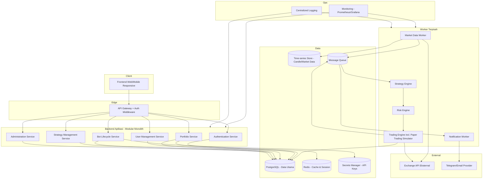
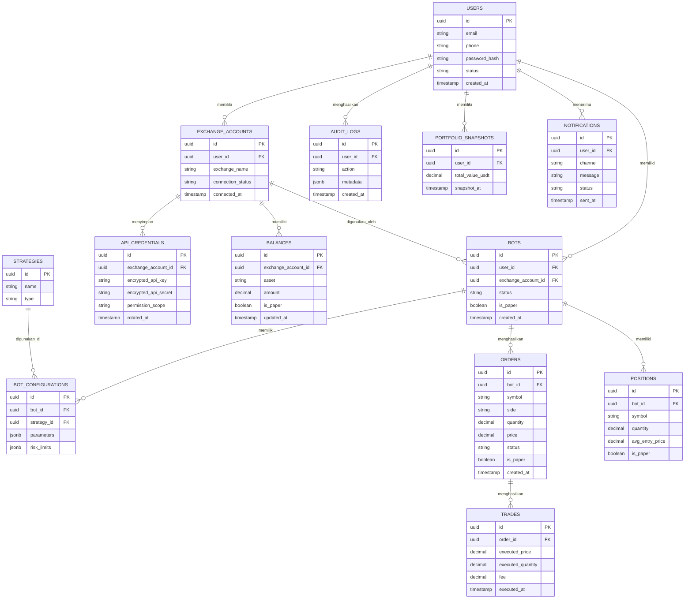
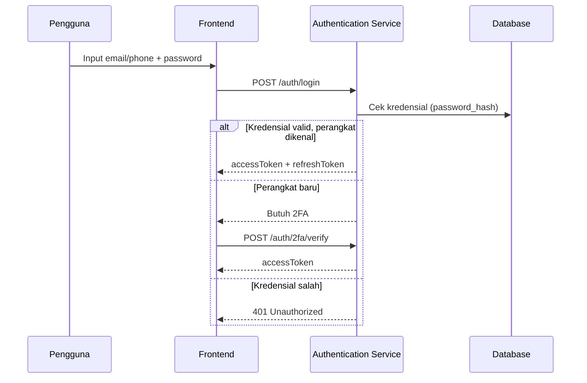
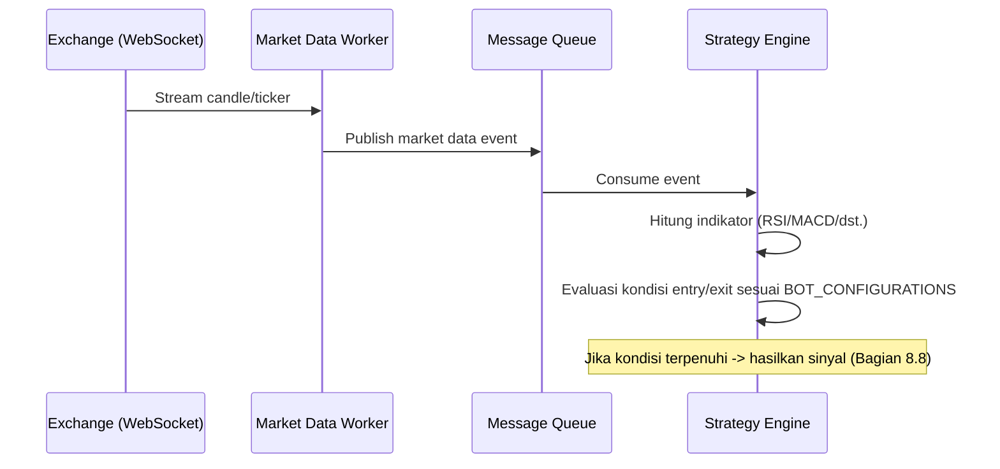
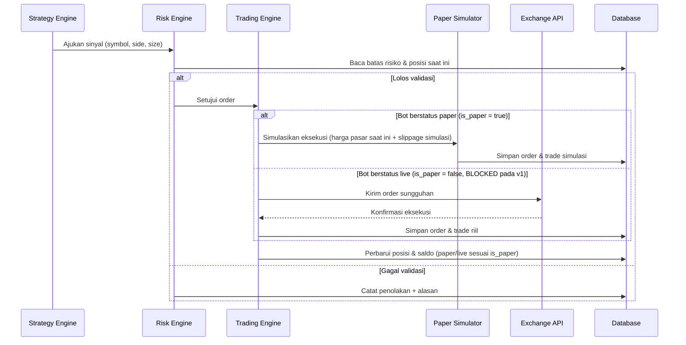
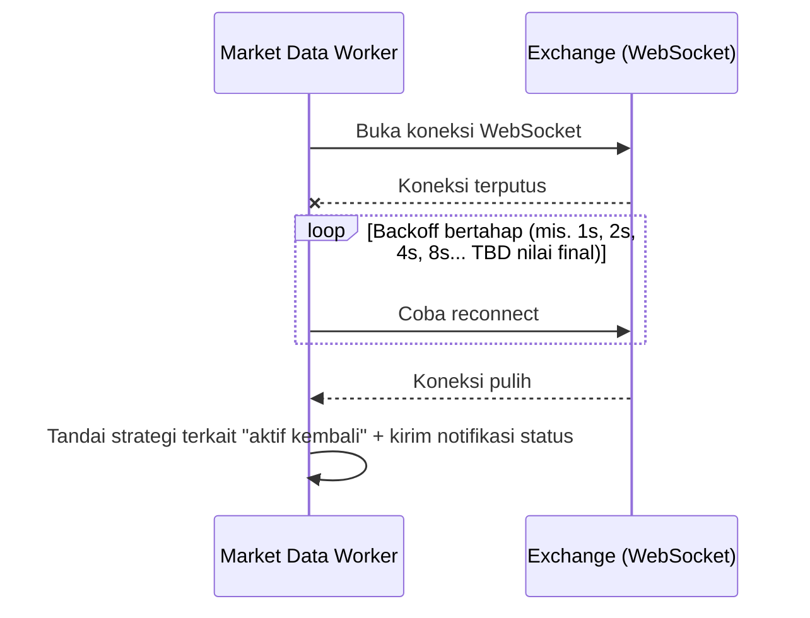

# SDD — Software Design Document
## Platform Trading Kripto Terpadu ("Nexa Trade" — nama kerja/placeholder)

> Dokumen ini menjelaskan bagaimana sistem dirancang untuk memenuhi requirement pada SRS_Platform_Trading_Terpadu_v1.0.md. Seluruh rekomendasi teknologi adalah **usulan untuk sistem baru**, bukan klaim tentang teknologi yang dipakai MoonBot/AIO Trade (yang sebagian besar tidak dapat diverifikasi — lihat laporan riset kompetitor).

---

## 1. Informasi Dokumen

| Field | Nilai |
|---|---|
| Identitas Dokumen | SDD-NEXA-001 |
| Versi | 1.0 |
| Status | DRAFT |
| Riwayat Perubahan | v1.0 — Draf awal, diturunkan dari SRS v1.0 |
| Pemilik Dokumen | `TBD` |
| Daftar Persetujuan | `TBD` |

---

## 2. Prinsip Desain

1. **Separation of concerns:** Strategy Engine, Risk Engine, dan Trading Engine adalah komponen terpisah dengan tanggung jawab tunggal masing-masing.
2. **Modularitas:** Setiap exchange diintegrasikan lewat adapter yang mengikuti interface umum, memudahkan penambahan exchange baru.
3. **Secure by design:** Keamanan (enkripsi, RBAC, audit) dirancang sejak awal, bukan ditambahkan belakangan.
4. **Least privilege:** Setiap komponen/service hanya diberi akses data yang benar-benar dibutuhkan.
5. **Observability:** Setiap komponen kritis menghasilkan log dan metrik yang dapat dipantau.
6. **Maintainability:** Kode terstruktur modular dengan dokumentasi API yang tersinkron.
7. **Idempotent processing:** Operasi order dan event dirancang agar aman dijalankan ulang tanpa efek ganda.
8. **Fail-safe behavior:** Saat terjadi ambiguitas/kegagalan, sistem memilih perilaku yang paling aman secara finansial (mis. menghentikan trading, bukan melanjutkan dengan asumsi).
9. **Extensibility:** Strategy Engine dirancang berbasis plugin agar strategi baru dapat ditambahkan tanpa mengubah inti sistem.
10. **Pengisolasian paper trading dan live trading:** Diterapkan di seluruh lapisan — database, service, dan UI (lihat SRS Bagian 3.8).

Status seluruh prinsip di atas: `PROPOSED` — prinsip rekayasa umum yang diusulkan untuk sistem baru.

---

## 3. Arsitektur Sistem

### 3.1 Pilihan Pendekatan Arsitektur

**Opsi yang dipertimbangkan:**
- **Monolith modular:** Semua komponen dalam satu basis kode/deployment unit, dipisah oleh modul internal yang jelas.
- **Modular monolith dengan worker terpisah:** Aplikasi utama monolitik, namun proses berat (trading engine, price streaming) berjalan sebagai worker/proses terpisah yang dapat diskalakan independen.
- **Microservices penuh:** Setiap modul (auth, strategy, risk, trading, notification) sebagai service independen dengan deployment terpisah.

**Rekomendasi untuk v1/MVP: Modular monolith dengan worker terpisah.** `PROPOSED`

**Alasan:** Tim pada tahap awal kemungkinan kecil (`TBD` ukuran tim belum dikonfirmasi); microservices penuh menambah kompleksitas operasional (service discovery, distributed tracing, deployment terpisah) yang belum sepadan dengan skala pengguna awal. Modular monolith dengan worker terpisah memberi keseimbangan: kode tetap mudah dikelola satu tim kecil, namun komponen paling sensitif-latensi (Trading Engine, price streaming) sudah terisolasi sebagai proses/worker terpisah sejak awal, sehingga migrasi ke microservices di masa depan (jika skala menuntut) lebih mudah karena batas modul sudah jelas.

### 3.2 Diagram Arsitektur Tingkat Tinggi



### 3.3 Penjelasan Hubungan Komponen
- **API Gateway** adalah satu-satunya pintu masuk dari klien; menangani autentikasi token dan routing ke service internal.
- **Bot Lifecycle Service** menyimpan konfigurasi bot dan berinteraksi dengan **Secrets Manager (Vault)** untuk mengambil referensi API key terenkripsi saat bot diaktifkan — kredensial mentah tidak pernah melewati database aplikasi dalam bentuk plaintext.
- **Market Data Worker** menerima stream harga dari exchange dan mendorongnya ke **Message Queue**, dikonsumsi oleh **Strategy Engine**.
- **Strategy Engine** menghasilkan sinyal, yang **wajib** melewati **Risk Engine** sebelum sampai ke **Trading Engine** — ini adalah *hard rule* arsitektur, bukan opsi.
- **Trading Engine** memisahkan jalur **paper trading** (simulasi internal, tidak pernah memanggil `EXCH`) dari jalur **live trading** (memanggil `EXCH` sungguhan) — keduanya berbagi interface yang sama namun implementasi berbeda (lihat Bagian 9).
- **Notification Worker** bersifat *fire-and-forget* terhadap alur trading utama — kegagalan pengiriman notifikasi tidak boleh memblokir Trading Engine (prinsip fail-safe/isolasi kegagalan).

---

## 4. Tech Stack

> Seluruh rekomendasi berikut adalah usulan untuk Nexa Trade, bukan representasi stack MoonBot/AIO Trade (yang tidak dapat diverifikasi dari sisi backend — lihat laporan riset kompetitor Bagian 3.D dan 4.D). Status: `PROPOSED` di seluruh tabel ini kecuali dinyatakan lain.

| Kebutuhan | Rekomendasi | Peran | Alasan Pemilihan | Alternatif | Kelebihan | Keterbatasan |
|---|---|---|---|---|---|---|
| Frontend | React + TypeScript | UI dashboard & interaksi pengguna | Ekosistem library charting/finansial luas, tipe statis mengurangi bug pada data finansial | Vue.js + TypeScript | Ekosistem besar, banyak talent | Butuh lebih banyak keputusan arsitektur state management |
| Backend utama | Node.js (NestJS) + TypeScript | API Gateway & service inti | Satu bahasa penuh full-stack dengan frontend, I/O non-blocking cocok untuk banyak koneksi realtime | Python (FastAPI) | Struktur modular bawaan NestJS mirip kebutuhan modular monolith | Performa numerik mentah kalah dari Go/Rust untuk komputasi berat |
| Trading Engine & Risk Engine | Go | Komponen kritis-latensi, konkurensi tinggi | Latensi rendah, konkurensi native (goroutine) cocok untuk banyak bot berjalan paralel | Rust | Performa tinggi, footprint memori kecil | Kurva belajar lebih curam, ekosistem library finansial lebih kecil dari Python |
| Strategy Engine (analitik/indikator) | Python (dengan opsi FastAPI sebagai service terpisah) | Perhitungan indikator teknikal & backtesting | Library data-science matang (pandas, numpy, ta-lib) | Implementasi indikator manual di Go/Node | Cepat dikembangkan, banyak library indikator siap pakai | Perlu jembatan komunikasi (API/queue) ke Trading Engine berbahasa lain |
| Database utama | PostgreSQL | Data transaksional (users, orders, bots) | ACID untuk data finansial, matang, banyak dukungan tooling | MySQL | Transaksi kuat, dukungan JSONB untuk data semi-terstruktur | Skalabilitas horizontal lebih rumit dibanding beberapa NoSQL |
| Time-series store | TimescaleDB (ekstensi PostgreSQL) | Data candle/harga historis volume tinggi | Tetap dalam ekosistem PostgreSQL, kompresi time-series bawaan | InfluxDB | Query time-series efisien | Perlu tuning khusus saat volume sangat besar |
| Cache/session | Redis | Cache saldo real-time, session, rate limiting | Cepat, mendukung struktur data pub/sub untuk notifikasi real-time | Memcached | Serbaguna (cache + pub/sub + queue sederhana) | Persistensi terbatas dibanding database utama |
| Task Queue | RabbitMQ | Antrian order/event antar-service | Lebih sederhana dari Kafka untuk skala awal, cukup andal | Apache Kafka | Mudah dioperasikan tim kecil | Kurang cocok jika volume event sangat tinggi di masa depan (migrasi ke Kafka jika perlu) |
| WebSocket | Socket.IO (Node.js) / native `ws` | Push data real-time ke dashboard | Dukungan reconnect bawaan, mudah diintegrasikan dengan NestJS | Native WebSocket API murni | Reconnect & fallback bawaan mengurangi kode custom | Overhead sedikit lebih besar dari WebSocket murni |
| API Documentation | OpenAPI/Swagger | Kontrak API terdokumentasi | Standar industri, terintegrasi baik dengan NestJS | GraphQL Schema | Mudah digenerate otomatis dari kode NestJS | Perlu disiplin menjaga sinkronisasi dokumentasi-kode |
| Testing | Jest (Node.js), Go testing package, Pytest (Python) | Unit & integration test per bahasa | Standar masing-masing ekosistem | - | Familiar bagi kebanyakan developer | Perlu strategi testing lintas-bahasa yang konsisten |
| Containerization | Docker | Konsistensi environment dev-staging-prod | Standar industri, mendukung deployment lokal & VPS/cloud | Podman | Ekosistem tooling luas | - |
| CI/CD | GitHub Actions (atau GitLab CI) | Otomasi build, test, deploy | Terintegrasi baik dengan repositori kode, banyak template siap pakai | Jenkins | Setup cepat, biaya rendah untuk tim kecil | Kustomisasi kompleks lebih terbatas dari Jenkins self-hosted |
| Monitoring | Prometheus + Grafana | Metrik sistem & trading engine | Standar de facto observability modern, integrasi luas | Datadog (SaaS) | Gratis/open-source, kontrol penuh | Perlu effort setup & maintenance sendiri |
| Error Tracking | Sentry | Pelacakan error aplikasi | Integrasi mudah lintas bahasa (Node.js, Go, Python) | Rollbar | Alerting cepat saat error produksi | Biaya berlangganan pada skala besar |
| Deployment | Docker Compose (awal) -> Kubernetes (saat skala menuntut) | Orkestrasi container | Docker Compose cukup untuk MVP di VPS tunggal; migrasi ke K8s saat kebutuhan skala horizontal nyata | Nomad | Migrasi bertahap sesuai kebutuhan riil, tidak over-engineering di awal | Kubernetes menambah kompleksitas operasional signifikan saat skala membesar |
| Secrets Management | HashiCorp Vault | Penyimpanan API key exchange terenkripsi | Dirancang khusus untuk secrets, mendukung rotasi kredensial | Cloud provider Secrets Manager (AWS/GCP) | Kontrol penuh, dapat dijalankan self-hosted maupun cloud | Menambah komponen operasional yang perlu dikelola |

---

## 5. Struktur Modul dan Komponen

### 5.1 Authentication Service
- **Tujuan:** Mengelola registrasi, login, sesi, dan 2FA.
- **Tanggung jawab:** Validasi kredensial, penerbitan/pencabutan token, integrasi OTP.
- **Batasan:** Tidak menyimpan logika bisnis trading apa pun.
- **Komponen internal:** Password hasher, Token issuer/validator, OTP dispatcher.
- **Interface:** REST endpoint `/api/v1/auth/*` (lihat Bagian 7).
- **Dependensi:** Redis (session), SMS/Email gateway (OTP).
- **Interaksi dengan modul lain:** Semua service lain memvalidasi token via middleware yang memanggil Authentication Service.
- **Risiko desain:** Kegagalan Authentication Service memblokir seluruh akses sistem — perlu redundansi/health check ketat.
- **Requirement dipenuhi:** FR-AUTH-001 s.d. 004, NFR-SEC-001 s.d. 003.

### 5.2 Exchange Adapter (per exchange)
- **Tujuan:** Menyediakan interface seragam ke berbagai exchange (Binance, dst.) sehingga Strategy/Trading Engine tidak perlu tahu detail API tiap exchange.
- **Interface umum yang diusulkan (ilustratif, bukan implementasi final):**

```typescript
interface ExchangeAdapter {
  connect(apiKey: string, apiSecret: string): Promise<ConnectionResult>;
  getBalance(): Promise<Balance[]>;
  getMarketData(symbol: string): Promise<Candle[]>;
  placeOrder(order: OrderRequest): Promise<OrderResult>; // hanya dipanggil jalur live trading
  cancelOrder(orderId: string): Promise<CancelResult>;
  getOrderStatus(orderId: string): Promise<OrderStatus>;
}
```
- **Tanggung jawab:** Menerjemahkan permintaan generik menjadi panggilan spesifik exchange, menangani rate limit dan format data unik tiap exchange.
- **Risiko desain:** Perubahan API exchange pihak ketiga dapat merusak adapter tanpa peringatan — perlu health check rutin & versioning adapter.
- **Requirement dipenuhi:** FR-EXC-001, FR-EXC-002, NFR-SCALE-004.

### 5.3 Strategy Engine
- **Tujuan:** Menghasilkan sinyal trading berdasarkan data pasar dan konfigurasi strategi.
- **Tanggung jawab:** Menghitung indikator teknikal, mengevaluasi kondisi entry/exit sesuai strategi terpilih.
- **Batasan:** Tidak pernah mengeksekusi order secara langsung — hanya menghasilkan sinyal yang diteruskan ke Risk Engine.
- **Requirement dipenuhi:** FR-STRAT-001, FR-STRAT-002.

### 5.4 Risk Engine
- **Tujuan:** Menjadi gatekeeper wajib sebelum sinyal diteruskan ke eksekusi.
- **Tanggung jawab:** Validasi ukuran posisi, batas kerugian, status circuit breaker.
- **Interaksi:** Menerima sinyal dari Strategy Engine, meneruskan keputusan (setuju/tolak) ke Trading Engine.
- **Requirement dipenuhi:** FR-RISK-001, FR-RISK-002.

### 5.5 Trading Engine (termasuk Paper Trading Simulator)
- **Tujuan:** Mengeksekusi (live) atau mensimulasikan (paper) order yang sudah disetujui Risk Engine.
- **Tanggung jawab:** Memanggil Exchange Adapter (live) atau Paper Trading Simulator internal (paper), mencatat hasil ke database.
- **Batasan:** Jalur paper dan live sepenuhnya terpisah secara kode dan data (lihat Bagian 9).
- **Requirement dipenuhi:** FR-ORD-001, FR-PAPER-001, FR-PAPER-002.

### 5.6 Portfolio Service
- **Tujuan:** Mengagregasi saldo dan posisi dari seluruh exchange terhubung untuk satu pengguna.
- **Requirement dipenuhi:** FR-PORT-001.

### 5.7 Notification Worker
- **Tujuan:** Mengirim notifikasi ke kanal eksternal (Telegram/email) berdasarkan event dari service lain.
- **Pola:** Event-driven — berlangganan ke Message Queue, tidak dipanggil langsung secara sinkron oleh Trading Engine (agar kegagalan notifikasi tidak memblokir trading).
- **Requirement dipenuhi:** FR-NOTIF-001.

### 5.8 Administration Service
- **Tujuan:** Menyediakan operasi administratif (kelola pengguna, lihat audit log).
- **Requirement dipenuhi:** FR-ADM-001, FR-SEC-001.

---

## 6. Desain Database

### 6.1 ERD (Ringkasan)



### 6.2 Catatan Desain Kunci
- **Kolom `is_paper`** hadir di seluruh tabel transaksional (Bots, Orders, Positions, Balances) sebagai penegakan teknis pemisahan paper/live trading di level database, bukan hanya di level aplikasi (lihat SRS Bagian 3.8).
- **API_CREDENTIALS** menyimpan `encrypted_api_key` dan `encrypted_api_secret` — nilai terenkripsi dengan kunci yang dikelola di Secrets Manager (Vault), **bukan** kunci enkripsi yang disimpan di kolom database yang sama.
- **`permission_scope`** pada API_CREDENTIALS dicatat eksplisit untuk memastikan sistem dapat memverifikasi ulang bahwa key tetap bertipe trade-only (mendukung FR-EXC-001, BR-KEY-001).
- Seluruh tabel disarankan memiliki audit field standar: `created_at`, `updated_at`, `created_by` (bila relevan).
- **Strategi migrasi:** Menggunakan tool migrasi database dengan versi terkontrol (mis. Prisma Migrate/Flyway — pilihan final `TBD`), setiap perubahan skema melalui review sebelum diterapkan ke produksi.
- **Index yang disarankan (bukan daftar final):** index pada `orders.bot_id`, `orders.created_at`, `trades.order_id`, `audit_logs.user_id` + `created_at` untuk mendukung query riwayat dan audit yang sering diakses. `PROPOSED`

---

## 7. Desain API

> **Catatan penting:** Seluruh endpoint di bawah ini adalah **rancangan API baru** untuk Nexa Trade. Tidak satu pun merupakan endpoint yang sudah tersedia atau terkonfirmasi dari MoonBot/AIO Trade.

### 7.1 Modul Authentication

| Method | URL | Tujuan | Auth | Request Body (ringkas) | Response Sukses | Response Error | Requirement |
|---|---|---|---|---|---|---|---|
| POST | `/api/v1/auth/register` | Registrasi akun baru | Tidak perlu | `{email/phone, password}` | `201 {userId, status}` | `400/409` | FR-AUTH-001 |
| POST | `/api/v1/auth/verify-otp` | Verifikasi OTP registrasi | Token registrasi sementara | `{otp}` | `200 {verified: true}` | `400` | FR-AUTH-001 |
| POST | `/api/v1/auth/login` | Login pengguna | Tidak perlu | `{email/phone, password}` | `200 {accessToken, refreshToken}` | `401` | FR-AUTH-002 |
| POST | `/api/v1/auth/2fa/verify` | Verifikasi 2FA | Token sesi sementara | `{code}` | `200 {accessToken}` | `401` | FR-AUTH-003 |

*Idempotency:* `register` bersifat idempoten terhadap kombinasi email/phone yang sama (mengembalikan 409 jika sudah ada, bukan membuat akun ganda). *Rate limiting:* endpoint ini termasuk kategori paling ketat (lihat NFR-SEC-007).

### 7.2 Modul Exchange Integration

| Method | URL | Tujuan | Auth | Requirement |
|---|---|---|---|---|
| POST | `/api/v1/exchange-accounts` | Hubungkan API key exchange baru | Bearer token | FR-EXC-001 |
| GET | `/api/v1/exchange-accounts` | Daftar exchange terhubung milik pengguna | Bearer token | FR-EXC-001 |
| DELETE | `/api/v1/exchange-accounts/{id}` | Putuskan koneksi exchange | Bearer token | FR-EXC-002 |

**Contoh detail endpoint `POST /api/v1/exchange-accounts`:**
- **Request body:** `{ "exchangeName": "binance", "apiKey": "...", "apiSecret": "..." }`
- **Validasi:** Sistem memanggil Exchange Adapter untuk test call sebelum menyimpan; jika `permission_scope` mengandung `withdraw`, request ditolak.
- **Response sukses:** `201 { "id": "...", "connectionStatus": "connected" }`
- **Response error:** `422 { "error": "INVALID_PERMISSION_SCOPE" }` atau `400 { "error": "INVALID_CREDENTIALS" }`
- **Requirement terkait:** FR-EXC-001, BR-KEY-001.

### 7.3 Modul Bot Management

| Method | URL | Tujuan | Requirement |
|---|---|---|---|
| POST | `/api/v1/bots` | Buat bot baru | FR-BOT-001 |
| PATCH | `/api/v1/bots/{id}/start` | Aktivasi bot | FR-BOT-002 |
| PATCH | `/api/v1/bots/{id}/stop` | Hentikan bot | FR-BOT-002 |
| GET | `/api/v1/bots/{id}` | Detail status bot | FR-BOT-001 |

*Idempotency:* `PATCH .../start` pada bot yang sudah berjalan mengembalikan status saat ini (200), bukan error — mencegah efek samping ganda akibat klik ulang/retry jaringan.

### 7.4 Modul Portfolio & Order

| Method | URL | Tujuan | Requirement |
|---|---|---|---|
| GET | `/api/v1/portfolio` | Ringkasan portofolio pengguna | FR-PORT-001 |
| GET | `/api/v1/orders?botId=&status=&from=&to=` | Riwayat order dengan filter | FR-ORD-002 |
| GET | `/api/v1/reports/pnl?botId=&period=` | Laporan PnL | FR-AN-001 |

### 7.5 Modul Administrasi (dibatasi role admin)

| Method | URL | Tujuan | Requirement |
|---|---|---|---|
| GET | `/api/v1/admin/users` | Daftar pengguna | FR-ADM-001 |
| PATCH | `/api/v1/admin/users/{id}/suspend` | Nonaktifkan sementara akun | FR-ADM-001 |
| GET | `/api/v1/admin/audit-logs` | Lihat log audit | FR-SEC-001 |

*Seluruh endpoint di atas didokumentasikan penuh dalam OpenAPI spec terpisah yang disinkronkan dengan kode (`TBD`, dibuat pada fase implementasi).*

---

## 8. Desain Alur Sistem

### 8.1 Login



### 8.2 Integrasi Exchange
Lihat PRD UC-002 untuk alur naratif; secara teknis mengikuti pola: `FE -> Backend -> Exchange Adapter -> Exchange API (test call) -> Vault (simpan terenkripsi jika valid) -> DB (simpan metadata koneksi)`.

### 8.3 - 8.7 Pengambilan Data Pasar, Pembuatan Bot, Aktivasi Paper Trading, Pemrosesan Candle, Pembuatan Sinyal


### 8.8 - 8.10 Validasi Risiko, Simulasi/Eksekusi Order, Pembaruan Saldo



### 8.11 - 8.12 Pembaruan Dashboard dan Notifikasi
Data hasil Bagian 8.8-8.10 didorong ke frontend via WebSocket (Portfolio Service mem-broadcast perubahan saldo/posisi), dan event yang sama dipublikasikan ke Message Queue untuk dikonsumsi Notification Worker (lihat Bagian 5.7) — dua konsumen independen dari satu event, tidak saling bergantung.

### 8.13 Penanganan Error dan Reconnect


---

## 9. Desain Trading Engine dan Strategy Engine

- **Lifecycle bot:** `Created -> Configured -> Active -> Paused -> Stopped -> Archived`. Transisi status dicatat di audit log.
- **Lifecycle strategi:** Strategi bersifat stateless per evaluasi (menerima data pasar terbaru + konfigurasi, menghasilkan sinyal) — state posisi disimpan terpisah di database, bukan di memori Strategy Engine, agar tahan terhadap restart.
- **Strategy interface (ilustratif):**

```typescript
interface Strategy {
  evaluate(marketData: Candle[], config: StrategyConfig, currentPosition: Position | null): Signal | null;
}
```
- **Strategy configuration:** Disimpan sebagai `jsonb` di `BOT_CONFIGURATIONS.parameters`, divalidasi terhadap skema per jenis strategi sebelum disimpan.
- **Candle processing:** Dilakukan oleh Market Data Worker, dipublikasikan sebagai event ke Strategy Engine — bukan strategi yang menarik data secara langsung (pull), untuk memisahkan sumber data dari logika keputusan.
- **Signal generation:** Sinyal berisi minimal `{botId, symbol, side, suggestedSize, reason}` — `reason` disimpan untuk keperluan audit dan penjelasan ke pengguna (transparansi, sesuai nilai produk di PRD Bagian 2.6).
- **Order simulation (paper trading):** Paper Simulator mengisi harga eksekusi berdasarkan harga pasar terkini pada saat sinyal diproses, dengan simulasi fee (sesuai skedul fee exchange yang direplikasi sebagai konfigurasi, bukan data hidup) dan simulasi slippage sederhana (`TBD` model matematisnya, mis. persentase tetap sebagai estimasi awal).
- **Latency simulation:** `TBD` — opsional pada v1; dapat ditambahkan jika evaluasi menunjukkan pengguna berpengalaman butuh simulasi yang lebih realistis mendekati kondisi live trading.
- **Position management:** Posisi diperbarui secara atomik bersamaan dengan pencatatan trade (dalam satu transaksi database) untuk mencegah inkonsistensi saldo vs. posisi.
- **State management & idempotensi:** Setiap event market data dan sinyal memiliki ID unik; pemrosesan ulang event dengan ID yang sama tidak menghasilkan efek ganda (dicek terhadap tabel pemrosesan event/dedup key).
- **Pemulihan setelah restart:** Karena state utama (posisi, konfigurasi) disimpan di database, Strategy/Trading Engine dapat di-restart tanpa kehilangan state — engine cukup membaca ulang posisi terakhir dari database saat startup.
- **Penanganan duplikasi event:** Message Queue dengan acknowledgment eksplisit; event yang gagal diproses dan tidak di-ack akan diproses ulang, dengan mekanisme dedup di atas mencegah efek ganda.

**Catatan eksplisit sesuai arahan:** Desain di atas berfokus pada *mekanisme dan perilaku sistem*, bukan klaim bahwa strategi tertentu (RSI, MACD, dst.) akan menghasilkan keuntungan — itu adalah keputusan/risiko yang sepenuhnya berada di tangan pengguna. `PROPOSED`

---

## 10. Desain Keamanan

- **Model ancaman (ringkas):** Ancaman utama yang diidentifikasi: (1) pencurian/kebocoran API key exchange, (2) pengambilalihan akun pengguna, (3) manipulasi sinyal/order oleh pihak tidak berwenang, (4) serangan pada endpoint publik (brute force, DDoS ringan), (5) kebocoran data melalui log/monitoring yang tidak dikontrol aksesnya. `PROPOSED`
- **Authentication & Authorization:** Lihat Bagian 5.1 dan SRS Bagian 5.3. Token JWT dengan masa berlaku pendek + refresh token; RBAC di level API Gateway.
- **Enkripsi & Key management:** API key/secret dienkripsi menggunakan kunci yang dikelola HashiCorp Vault, terpisah dari database aplikasi; TLS 1.2+ wajib untuk seluruh komunikasi.
- **Secrets management:** Kredensial layanan pihak ketiga (SMTP, Telegram Bot Token) juga disimpan di Vault, tidak di file konfigurasi/kode sumber.
- **Isolasi data pengguna:** Query database selalu difilter berdasarkan `user_id` dari token yang tervalidasi — tidak ada endpoint yang mengizinkan akses lintas-pengguna tanpa role admin eksplisit.
- **Proteksi API:** Rate limiting per-IP dan per-user pada endpoint sensitif; validasi input di layer backend (bukan hanya frontend); header keamanan standar (CSP, HSTS) pada respons web.
- **Audit log:** Diimplementasikan sebagai tabel append-only (lihat Bagian 6), dengan proses penulisan yang terpisah dari flow bisnis utama agar kegagalan logging tidak menghentikan transaksi (namun kegagalan logging itu sendiri harus terpantau dan dialarm).
- **Proteksi bot dan worker:** Worker (Trading Engine, dll.) berjalan di jaringan internal tanpa akses langsung dari internet publik; hanya API Gateway yang terekspos.
- **Keamanan deployment:** Lihat Bagian 11.
- **Pengamanan koneksi exchange:** API key dibatasi trade-only (ditegakkan di FR-EXC-001); disarankan menambahkan IP whitelisting di sisi exchange jika didukung.
- **Prosedur rotasi kredensial:** Kolom `rotated_at` di `API_CREDENTIALS` mendukung kebijakan rotasi berkala (`TBD` frekuensinya); pengguna dapat/didorong memperbarui API key secara berkala.
- **Incident response:** `TBD` — prosedur formal (siapa dihubungi, langkah mitigasi saat kebocoran terdeteksi) perlu disusun terpisah sebelum go-live produksi, bukan bagian dari SDD teknis ini semata.

---

## 11. Desain Deployment dan Infrastruktur

### 11.1 Lingkungan Lokal (Development)
- Docker Compose menjalankan seluruh service (backend, worker, PostgreSQL, Redis, RabbitMQ) dalam satu perintah untuk kemudahan development di laptop/MacBook developer.
- Environment variables dikelola via file `.env` lokal (tidak pernah di-commit ke repositori) — untuk produksi digantikan Vault.
- Logging lokal cukup ke stdout/console; backup lokal tidak diperlukan (data dev bersifat sementara/dapat di-reset).

### 11.2 Lingkungan VPS/Server Online
- **Reverse proxy:** Nginx atau Caddy di depan API Gateway, menangani TLS termination.
- **Domain & HTTPS:** Sertifikat via Let's Encrypt (otomatis diperbarui).
- **Firewall:** Hanya port 80/443 terbuka ke publik; port database/queue/worker internal tidak diekspos ke internet.
- **Database:** PostgreSQL terkelola (managed service) direkomendasikan untuk produksi guna mengurangi beban operasional backup/patching, dibanding self-hosted. `PROPOSED`
- **Worker:** Dijalankan sebagai proses terpisah (container terpisah) dari API utama, dapat diskalakan independen.
- **Process management:** Docker restart policy (`unless-stopped`) minimal; orkestrasi lebih lanjut (Kubernetes) saat skala menuntut (lihat Bagian 4).
- **Monitoring & Backup:** Lihat Bagian 12; backup database terjadwal (mis. harian) dengan retensi tertentu (`TBD`) dan pengujian restore berkala (bukan hanya backup yang tidak pernah diuji pulihnya).
- **Secrets:** Vault dijalankan sebagai service terpisah dengan akses dibatasi jaringan internal.
- **Update & rollback:** Deployment via CI/CD dengan strategi rolling update sederhana; rollback dilakukan dengan menerapkan kembali image versi sebelumnya yang sudah diuji.

### 11.3 Perbedaan Konfigurasi Development, Staging, Production

| Aspek | Development | Staging | Production |
|---|---|---|---|
| Data | Data dummy/reset bebas | Data mirip produksi (anonim) | Data pengguna riil |
| Exchange | Sandbox/testnet exchange jika tersedia | Sandbox/testnet | API exchange sungguhan (hanya setelah live trading disetujui — `BLOCKED`) |
| Secrets | `.env` lokal | Vault (namespace staging) | Vault (namespace production) |
| Monitoring | Opsional | Aktif, alerting ke tim dev | Aktif penuh, alerting ke on-call |
| Live trading | Tidak pernah aktif | Tidak pernah aktif (kecuali uji terbatas dengan persetujuan eksplisit) | `BLOCKED` sampai kepatuhan hukum terkonfirmasi |

---

## 12. Desain Observability

- **Struktur log:** Format JSON terstruktur dengan field minimal: `timestamp, service, level, traceId, message, metadata`.
- **Metrics:** Latensi endpoint, throughput order per menit, tingkat kegagalan order, jumlah bot aktif, panjang antrian Message Queue.
- **Health checks:** Endpoint `/health` per service mengecek konektivitas database, cache, dan queue.
- **Readiness checks:** Memastikan service siap menerima trafik (mis. koneksi database berhasil) sebelum ditandai "ready" oleh orkestrator.
- **Liveness checks:** Mendeteksi proses yang macet (hang) untuk di-restart otomatis oleh orkestrator.
- **Error tracking:** Sentry terintegrasi di seluruh service untuk menangkap exception tak tertangani.
- **Alerting:** `TBD` — kanal alerting final (Slack/email/PagerDuty) belum ditentukan; minimal harus mencakup: Trading Engine down, tingkat kegagalan order melebihi ambang, koneksi exchange terputus lebih dari durasi tertentu.
- **Monitoring trading engine:** Dashboard khusus menampilkan jumlah sinyal dihasilkan vs. ditolak Risk Engine vs. dieksekusi — membantu mendeteksi anomali strategi/risk sejak dini.
- **Monitoring koneksi exchange:** Status koneksi per exchange account ditampilkan baik di dashboard pengguna maupun dashboard internal admin.
- **Audit aktivitas pengguna:** Terintegrasi dengan Audit Log (Bagian 6), dapat difilter dan diekspor oleh administrator untuk investigasi.

---

## 13. Strategi Pengujian Teknis

| Jenis Pengujian | Cakupan | Alat (usulan) | Status |
|---|---|---|---|
| Unit test | Logika bisnis per fungsi/kelas, terutama Strategy Engine dan Risk Engine | Jest, Go testing, Pytest | PROPOSED |
| Integration test | Interaksi antar-service (mis. Bot Service <-> Vault <-> Database) | Supertest, testcontainers | PROPOSED |
| Contract test | Kontrak API antara Frontend-Backend dan antar-service internal | Pact (opsional) | TBD |
| End-to-end test | Alur pengguna penuh (registrasi -> koneksi exchange -> aktivasi paper trading -> lihat laporan) | Playwright/Cypress | PROPOSED |
| Backtesting | Validasi strategi terhadap data historis sebelum dipakai pengguna | Skrip khusus berbasis data historis exchange | PROPOSED |
| Paper trading test | Validasi bahwa jalur paper trading tidak pernah memanggil endpoint eksekusi live | Test khusus yang memverifikasi mock Exchange Adapter tidak terpanggil pada mode paper | PROPOSED |
| Load test | Kapasitas concurrent users & throughput order (mengisi target NFR-PERF yang masih `TBD`) | k6/JMeter | PROPOSED |
| Security test | Kerentanan umum (OWASP Top 10), pengujian rate limiting, pengujian isolasi data antar-pengguna | OWASP ZAP, penetration test manual/pihak ketiga | PROPOSED |
| Failure recovery test | Simulasi exchange down, worker crash, database failover | Chaos testing sederhana (mematikan container secara sengaja di staging) | PROPOSED |
| Database migration test | Memastikan migrasi skema berjalan aman tanpa kehilangan data | Uji migrasi di salinan data staging sebelum diterapkan ke produksi | PROPOSED |

---

*Dokumen ini melengkapi PRD_Platform_Trading_Terpadu_v1.0.md dan SRS_Platform_Trading_Terpadu_v1.0.md. Lihat bagian penutup gabungan (matriks keterlacakan terpadu dan daftar gap/risiko) pada ringkasan integrasi yang menyertai ketiga dokumen ini.*
