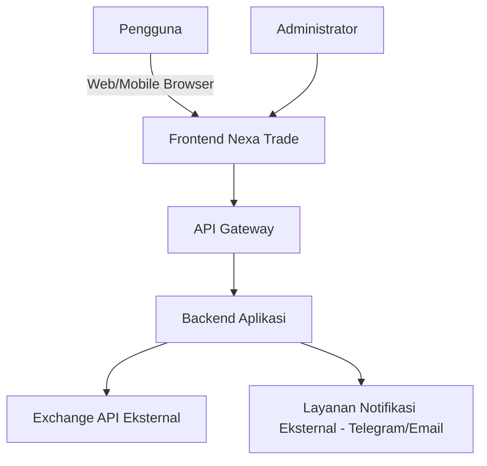

# SRS — Software Requirements Specification
## Platform Trading Kripto Terpadu ("Nexa Trade" — nama kerja/placeholder)

> Dokumen ini menurunkan PRD_Platform_Trading_Terpadu_v1.0.md menjadi kebutuhan perangkat lunak yang terukur dan dapat diuji. Status: `CONFIRMED`, `RESEARCHED`, `PROPOSED`, `TBD`, `BLOCKED`.

---

## 1. Informasi Dokumen

| Field | Nilai |
|---|---|
| Identitas Dokumen | SRS-NEXA-001 |
| Versi | 1.0 |
| Status | DRAFT |
| Riwayat Perubahan | v1.0 — Draf awal, diturunkan dari PRD v1.0 |
| Pemilik Dokumen | `TBD` |
| Daftar Persetujuan | `TBD` — belum ada tanda tangan/approval |

---

## 2. Pendahuluan

### 2.1 Tujuan Dokumen
Menjelaskan seluruh kebutuhan fungsional dan nonfungsional perangkat lunak Nexa Trade secara cukup jelas untuk dijadikan dasar implementasi dan pengujian (QA), tanpa menjelaskan detail implementasi internal (didetailkan di SDD).

### 2.2 Ruang Lingkup Sistem
Sistem mencakup: autentikasi pengguna, integrasi API exchange, strategy engine, paper trading engine, manajemen risiko, manajemen order/portofolio, analitik, notifikasi, dan panel administrasi — sesuai ruang lingkup v1 pada PRD Bagian 2.7. Live trading dengan dana riil berstatus `BLOCKED` sampai kepatuhan hukum terkonfirmasi (lihat PRD Bagian 9).

### 2.3 Definisi Istilah
- **Paper Trading:** Simulasi trading menggunakan saldo virtual, tanpa order yang benar-benar dikirim ke exchange.
- **Live Trading:** Trading dengan dana riil pengguna, order benar-benar dikirim ke exchange.
- **Bot:** Instans otomatisasi yang menjalankan satu strategi pada satu pasangan aset di satu exchange.
- **Strategy Engine:** Komponen yang menghasilkan sinyal beli/jual berdasarkan data pasar dan parameter strategi.
- **Risk Engine:** Komponen yang memvalidasi sinyal terhadap batas risiko sebelum eksekusi diizinkan.
- **Trading Engine:** Komponen yang mengeksekusi (atau mensimulasikan) order ke exchange.
- **API Key trade-only:** Kredensial API exchange yang diberi izin trading tanpa izin penarikan dana (withdrawal).

### 2.4 Akronim
PRD, SRS, SDD, FR (Functional Requirement), NFR (Non-Functional Requirement), BR (Business Rule), RBAC (Role-Based Access Control), OTP, 2FA, KYC, PnL (Profit and Loss), API, REST, ERD, QA, SLA.

### 2.5 Referensi
- PRD_Platform_Trading_Terpadu_v1.0.md
- Laporan riset kompetitor MoonBot & AIO Trade (dokumen terpisah, hasil riset sebelumnya dalam proyek ini)
- SDD_Platform_Trading_Terpadu_v1.0.md (dokumen turunan dari SRS ini)

### 2.6 Target Pembaca
Product Manager, Business Analyst, Software Architect, Frontend/Backend Developer, DevOps Engineer, QA Engineer, Security Engineer, Project Manager.

### 2.7 Konvensi Penulisan
- ID requirement fungsional: `FR-<MODUL>-<nomor>`.
- ID requirement nonfungsional: `NFR-<KATEGORI>-<nomor>`.
- ID business rule: `BR-<MODUL>-<nomor>`.
- Setiap requirement mencantumkan status kebutuhan sesuai definisi PRD Bagian 9 (`CONFIRMED`/`RESEARCHED`/`PROPOSED`/`TBD`/`BLOCKED`).

### 2.8 Asumsi dan Batasan
- Diasumsikan tim pengembang tersedia dan memiliki kapasitas backend, frontend, dan DevOps — belum dikonfirmasi ukuran tim aktual. `TBD`
- Diasumsikan integrasi exchange pertama menggunakan REST + WebSocket API publik exchange yang bersangkutan (bukan API pihak ketiga agregator) — belum final. `TBD`
- Batasan: seluruh requirement live trading berstatus `BLOCKED` sampai status hukum jelas.

---

## 3. Gambaran Umum Sistem

### 3.1 Konteks Sistem

### 3.2 Tujuan Sistem
Menyediakan platform trading otomatis kripto yang aman, dimulai dari mode simulasi (paper trading), dengan kemungkinan ekspansi ke live trading pada fase yang disetujui secara terpisah.

### 3.3 Aktor
| Aktor | Deskripsi |
|---|---|
| Pengguna Terdaftar | Pemilik akun yang mengonfigurasi dan menjalankan bot |
| Administrator | Staf internal yang mengelola pengguna dan memantau sistem |
| Sistem Exchange Eksternal | Binance/exchange lain sebagai penyedia data pasar & eksekusi order |
| Sistem Notifikasi Eksternal | Telegram Bot API/penyedia email |

### 3.4 Lingkungan Operasional
Aplikasi web responsif diakses via browser modern (Chrome, Safari, Firefox versi terbaru); backend berjalan di lingkungan cloud/VPS dengan HTTPS wajib. `PROPOSED`

### 3.5 Integrasi Eksternal
Exchange API (data pasar & eksekusi order), penyedia notifikasi (Telegram Bot API/SMTP email). Detail di Bagian 6.

### 3.6 Batas Sistem
Sistem **tidak** mengkustodi dana pengguna; seluruh dana tetap berada di exchange pihak ketiga. Sistem hanya menyimpan kredensial API (terenkripsi) dan data operasional (riwayat order, konfigurasi strategi, log).

### 3.7 Ketergantungan Eksternal
Ketersediaan dan stabilitas API exchange pihak ketiga adalah dependensi kritis di luar kendali langsung tim (lihat NFR-AVAIL di Bagian 5.2).

### 3.8 Mode Paper Trading vs Live Trading
**Pemisahan wajib dan tegas** sesuai instruksi:
| Aspek | Paper Trading | Live Trading |
|---|---|---|
| Konfigurasi | Terpisah sepenuhnya dari konfigurasi live | Terpisah sepenuhnya dari konfigurasi paper |
| Data | Disimpan di skema/tabel terpisah, ditandai `is_paper=true` | Ditandai `is_paper=false` |
| Saldo | Saldo virtual yang dikelola sistem sendiri | Saldo riil dari exchange, hanya dibaca (read) via API |
| Izin | Tidak memerlukan API key aktif untuk mulai (dapat memakai data pasar publik) | Wajib API key trade-only tervalidasi |
| Pengamanan | Risiko rendah — tidak ada dana riil terlibat | Risiko tinggi — memerlukan lapisan konfirmasi tambahan sebelum aktivasi (lihat BR-TRADE-001) |

Status modul live trading pada v1: `BLOCKED` sampai kepatuhan hukum terkonfirmasi (lihat PRD Bagian 9).

---

## 4. Persyaratan Fungsional

> Modul yang dianalisis mengikuti daftar pada prompt. Modul yang statusnya `TBD`/belum disetujui ditandai eksplisit dan tidak dianggap final.

### 4.1 Modul: Authentication & Authorization

**FR-AUTH-001**
- **Nama:** Registrasi Akun
- **Deskripsi:** Sistem harus menyediakan mekanisme registrasi akun baru menggunakan email dan/atau nomor telepon.
- **Aktor:** Pengguna baru.
- **Prasyarat:** Tidak ada akun terdaftar dengan email/nomor yang sama.
- **Input:** Email atau nomor telepon, password, persetujuan syarat & ketentuan.
- **Alur utama:** Pengguna mengisi form → sistem memvalidasi format → sistem mengirim OTP → pengguna memasukkan OTP → akun dibuat berstatus "belum terverifikasi penuh" hingga langkah verifikasi identitas dasar (jika ada) selesai.
- **Alur alternatif:** Email/nomor sudah terdaftar → sistem menampilkan pesan dan mengarahkan ke login/reset password.
- **Kondisi kesalahan:** OTP salah 3x → cooldown sementara sebelum dapat mencoba lagi.
- **Output:** Akun baru dengan status terverifikasi.
- **Acceptance criteria:** Registrasi hanya berhasil setelah OTP tervalidasi; password disimpan ter-hash (lihat NFR-SEC-001).
- **Prioritas:** Must Have.
- **Dependensi:** Layanan OTP (SMS/email gateway).
- **Sumber:** PRD US-001; pola umum industri fintech (`RESEARCHED` dari pengamatan alur OTP MoonBot, `PROPOSED` untuk implementasi baru).
- **Status:** PROPOSED

**FR-AUTH-002**
- **Nama:** Login
- **Deskripsi:** Sistem harus menyediakan mekanisme autentikasi pengguna menggunakan kredensial yang valid (email/telepon + password).
- **Aktor:** Pengguna terdaftar.
- **Alur utama:** Input kredensial → validasi → sesi/token diterbitkan.
- **Alur alternatif:** Login dari perangkat baru → verifikasi tambahan (OTP/2FA) dipicu (lihat FR-AUTH-003).
- **Kondisi kesalahan:** Kredensial salah 5x → akun terkunci sementara + notifikasi ke pengguna.
- **Output:** Token sesi (JWT/setara) dengan masa berlaku terbatas.
- **Acceptance criteria:** Token kedaluwarsa otomatis setelah durasi tertentu (`TBD`, usulan 30 menit idle-timeout, perlu divalidasi UX).
- **Prioritas:** Must Have.
- **Status:** PROPOSED

**FR-AUTH-003**
- **Nama:** Autentikasi Dua Faktor (2FA)
- **Deskripsi:** Sistem harus mendukung 2FA untuk aksi sensitif: login perangkat baru, perubahan API key, perubahan pengaturan risiko, upgrade ke live trading.
- **Prioritas:** Should Have.
- **Status:** PROPOSED

**FR-AUTH-004**
- **Nama:** Role-Based Access Control (RBAC)
- **Deskripsi:** Sistem harus membedakan hak akses minimal antara peran Pengguna dan Administrator, dengan prinsip least privilege.
- **Acceptance criteria:** Pengguna tidak dapat mengakses endpoint administratif; percobaan akses ditolak dengan HTTP 403.
- **Prioritas:** Must Have.
- **Status:** PROPOSED

### 4.2 Modul: User Management

**FR-USER-001**
- **Nama:** Kelola Profil
- **Deskripsi:** Pengguna dapat melihat dan memperbarui data profil dasar (nama, email, telepon, preferensi notifikasi).
- **Prioritas:** Must Have.
- **Status:** PROPOSED

**FR-USER-002**
- **Nama:** Kelola Alamat Penarikan/Rekening Referensi (jika relevan untuk pelaporan)
- **Deskripsi:** `TBD` — perlu keputusan apakah sistem menyimpan referensi rekening/alamat, mengingat sistem tidak mengkustodi dana. Kemungkinan tidak diperlukan pada v1 karena dana tetap di exchange.
- **Status:** TBD

### 4.3 Modul: Exchange Integration

**FR-EXC-001**
- **Nama:** Hubungkan API Key Exchange
- **Deskripsi:** Sistem harus memungkinkan pengguna menghubungkan akun exchange melalui API key & secret, dengan validasi izin (harus trade-only, tanpa izin withdrawal) sebelum disimpan.
- **Aktor:** Pengguna.
- **Prasyarat:** Akun terverifikasi.
- **Input:** API key, API secret, pilihan exchange.
- **Alur utama:** Input kredensial → sistem melakukan test call (mis. cek saldo/permission) → jika permission mengandung izin withdrawal, tolak → simpan terenkripsi jika valid.
- **Kondisi kesalahan:** Key tidak valid, key kedaluwarsa, rate limit exchange terlampaui saat validasi.
- **Output:** Status koneksi "Terhubung"/"Gagal".
- **Acceptance criteria:** Key dengan izin withdrawal aktif selalu ditolak sistem, tanpa terkecuali.
- **Prioritas:** Must Have.
- **Status:** PROPOSED

**FR-EXC-002**
- **Nama:** Putuskan/Perbarui Koneksi Exchange
- **Deskripsi:** Pengguna dapat memutuskan koneksi atau memperbarui API key yang sudah tersimpan.
- **Acceptance criteria:** Memutuskan koneksi menghentikan seluruh bot aktif yang bergantung pada koneksi tersebut, dengan konfirmasi eksplisit dari pengguna.
- **Prioritas:** Must Have.
- **Status:** PROPOSED

### 4.4 Modul: Market Data

**FR-MKT-001**
- **Nama:** Tampilkan Data Harga Real-time
- **Deskripsi:** Sistem harus menampilkan data harga/candle real-time untuk pasangan aset yang didukung.
- **Prioritas:** Must Have.
- **Status:** PROPOSED

### 4.5 Modul: Strategy Management

**FR-STRAT-001**
- **Nama:** Pilih Strategi dari Katalog
- **Deskripsi:** Pengguna dapat memilih strategi dari daftar strategi berbasis indikator teknikal umum (mis. RSI, MACD, Bollinger Bands — indikator ini pengetahuan umum trading, bukan kekayaan intelektual eksklusif kompetitor manapun, lihat laporan riset Bagian 6).
- **Prioritas:** Must Have.
- **Status:** PROPOSED

**FR-STRAT-002**
- **Nama:** Kustomisasi Parameter Strategi
- **Deskripsi:** Pengguna dapat mengubah parameter strategi (periode indikator, ambang sinyal) dalam batas yang divalidasi sistem.
- **Acceptance criteria:** Parameter di luar rentang wajar (`TBD`, rentang final ditetapkan tim strategi) ditolak dengan pesan jelas.
- **Prioritas:** Should Have.
- **Status:** PROPOSED

### 4.6 Modul: Bot Lifecycle Management

**FR-BOT-001**
- **Nama:** Buat Bot
- **Deskripsi:** Pengguna dapat membuat bot baru dengan memilih exchange, pasangan aset, strategi, dan parameter risiko.
- **Prioritas:** Must Have.
- **Status:** PROPOSED

**FR-BOT-002**
- **Nama:** Start/Stop Bot
- **Deskripsi:** Pengguna dapat mengaktifkan atau menghentikan bot kapan saja.
- **Acceptance criteria:** Perintah stop dieksekusi dan status bot berubah menjadi "Stopped" dalam waktu singkat (`TBD` target SLA); posisi terbuka ditangani sesuai kebijakan yang dikomunikasikan jelas ke pengguna (mis. tidak otomatis ditutup tanpa persetujuan, kecuali darurat).
- **Prioritas:** Must Have.
- **Status:** PROPOSED

**FR-BOT-003**
- **Nama:** Batas Jumlah Bot per Pengguna
- **Deskripsi:** Sistem membatasi jumlah bot aktif per pengguna sesuai tingkat langganan (lihat BR-BOT-001).
- **Prioritas:** Should Have.
- **Status:** PROPOSED

### 4.7 Modul: Paper Trading Engine

**FR-PAPER-001**
- **Nama:** Aktivasi Mode Paper Trading
- **Deskripsi:** Sistem harus menyediakan mode paper trading dengan saldo virtual awal, sepenuhnya terisolasi dari live trading (lihat Bagian 3.8).
- **Acceptance criteria:** Order paper trading tidak pernah memanggil endpoint eksekusi order riil exchange.
- **Prioritas:** Must Have.
- **Status:** PROPOSED

**FR-PAPER-002**
- **Nama:** Reset Saldo Simulasi
- **Deskripsi:** Pengguna dapat mereset saldo paper trading untuk memulai simulasi baru.
- **Prioritas:** Should Have.
- **Status:** PROPOSED

### 4.8 Modul: Trading and Order Management

**FR-ORD-001**
- **Nama:** Simulasi/Eksekusi Order
- **Deskripsi:** Sistem memproses sinyal strategi yang lolos validasi risiko menjadi order (simulasi pada paper trading; benar-benar dikirim ke exchange pada live trading — `BLOCKED` untuk v1).
- **Prioritas:** Must Have (untuk jalur paper trading).
- **Status:** PROPOSED (paper), BLOCKED (live)

**FR-ORD-002**
- **Nama:** Riwayat Order
- **Deskripsi:** Pengguna dapat melihat riwayat seluruh order dengan filter tanggal, status, dan pasangan aset.
- **Prioritas:** Must Have.
- **Status:** PROPOSED

### 4.9 Modul: Portfolio & Wallet

**FR-PORT-001**
- **Nama:** Ringkasan Portofolio
- **Deskripsi:** Sistem menampilkan agregasi saldo dan posisi dari seluruh exchange terhubung.
- **Prioritas:** Must Have.
- **Status:** PROPOSED

### 4.10 Modul: Risk Management

**FR-RISK-001**
- **Nama:** Validasi Batas Risiko Sebelum Eksekusi
- **Deskripsi:** Setiap sinyal dari Strategy Engine wajib divalidasi Risk Engine (limit kerugian, ukuran posisi maksimum) sebelum diteruskan ke Trading Engine.
- **Acceptance criteria:** Sinyal yang melanggar batas risiko ditolak dan dicatat di log, tidak pernah diteruskan ke eksekusi.
- **Prioritas:** Must Have.
- **Status:** PROPOSED

**FR-RISK-002**
- **Nama:** Circuit Breaker
- **Deskripsi:** Sistem dapat menghentikan seluruh aktivitas trading otomatis pengguna/global saat kondisi ekstrem terdeteksi (mis. volatilitas ekstrem, kegagalan berulang).
- **Prioritas:** Should Have.
- **Status:** PROPOSED

### 4.11 Modul: Analytics & Reporting

**FR-AN-001**
- **Nama:** Laporan PnL
- **Deskripsi:** Sistem menghitung dan menampilkan laba/rugi per bot, per periode, dengan metodologi perhitungan yang didokumentasikan dan konsisten.
- **Prioritas:** Must Have.
- **Status:** PROPOSED

### 4.12 Modul: Notifications

**FR-NOTIF-001**
- **Nama:** Notifikasi Event Penting
- **Deskripsi:** Sistem mengirim notifikasi (Telegram/email) untuk event: order tereksekusi, bot berhenti otomatis, batas risiko tercapai, langganan akan berakhir.
- **Prioritas:** Should Have.
- **Status:** PROPOSED

### 4.13 Modul: Administration

**FR-ADM-001**
- **Nama:** Kelola Pengguna
- **Deskripsi:** Administrator dapat melihat, menonaktifkan sementara, atau menutup akun pengguna sesuai kebijakan.
- **Prioritas:** Must Have.
- **Status:** PROPOSED

### 4.14 Modul: Audit Logging

**FR-SEC-001**
- **Nama:** Audit Log Aksi Sensitif
- **Deskripsi:** Sistem mencatat seluruh aksi sensitif (perubahan API key, perubahan risiko, login perangkat baru, aksi admin) dalam log yang tidak dapat diubah/dihapus manual.
- **Prioritas:** Must Have.
- **Status:** PROPOSED

### 4.15 Modul: Monitoring

**FR-MON-001**
- **Nama:** Health Check Sistem
- **Deskripsi:** Sistem menyediakan endpoint health check untuk memantau ketersediaan layanan inti.
- **Prioritas:** Should Have.
- **Status:** PROPOSED

### 4.16 Modul: Backup and Recovery

**FR-BAK-001**
- **Nama:** Backup Data Rutin
- **Deskripsi:** Sistem melakukan backup database rutin dengan prosedur pemulihan yang teruji.
- **Prioritas:** Must Have (untuk kesiapan produksi, bukan MVP awal).
- **Status:** PROPOSED

---

## 5. Persyaratan Nonfungsional

### 5.1 Performance

| ID | Deskripsi | Target Usulan | Status |
|---|---|---|---|
| NFR-PERF-001 | Waktu respons API untuk endpoint baca data (dashboard, riwayat) | < 500 ms (p95) | PROPOSED — perlu validasi kapasitas infrastruktur |
| NFR-PERF-002 | Waktu pemuatan awal dashboard | < 3 detik pada koneksi 4G standar | PROPOSED |
| NFR-PERF-003 | Latensi pembaruan data real-time (harga, saldo) via WebSocket | < 2 detik dari sumber data | PROPOSED |
| NFR-PERF-004 | Kapasitas concurrent users pada MVP | `TBD` — belum ada proyeksi jumlah pengguna |
| NFR-PERF-005 | Kapasitas pemrosesan order per detik (jalur paper trading) | `TBD` — perlu load testing (lihat Bagian 4.10) |

*Metode pengujian:* load testing dengan tool seperti k6/JMeter terhadap endpoint kritis; NFR-PERF-003 diuji dengan mengukur selisih timestamp sumber vs. tampilan klien.

### 5.2 Availability & Reliability

| ID | Deskripsi | Status |
|---|---|---|
| NFR-AVAIL-001 | Sistem harus tetap dapat diakses (read-only dashboard) bahkan saat exchange eksternal down, dengan indikator status yang jelas ke pengguna. | PROPOSED |
| NFR-AVAIL-002 | Koneksi WebSocket ke exchange yang terputus harus otomatis mencoba reconnect dengan strategi backoff bertahap. | PROPOSED |
| NFR-AVAIL-003 | Setiap operasi order harus idempoten — permintaan yang dikirim ulang akibat retry tidak boleh menghasilkan order duplikat. | PROPOSED |
| NFR-AVAIL-004 | Kegagalan satu komponen (mis. Notification Service) tidak boleh menghentikan fungsi inti (Trading Engine). | PROPOSED |
| NFR-AVAIL-005 | Target ketersediaan sistem inti | Diusulkan 99.5%, `TBD` — belum divalidasi kapasitas operasional tim |

*Metode pengujian:* chaos testing sederhana (simulasi exchange down), pengujian idempotensi dengan permintaan duplikat.

### 5.3 Security

| ID | Deskripsi | Status |
|---|---|---|
| NFR-SEC-001 | Password harus di-hash menggunakan algoritma standar industri (bcrypt/Argon2), tidak pernah disimpan plaintext. | PROPOSED |
| NFR-SEC-002 | Sesi/token harus punya masa berlaku terbatas dan mekanisme revoke. | PROPOSED |
| NFR-SEC-003 | 2FA wajib untuk aksi sensitif (lihat FR-AUTH-003). | PROPOSED |
| NFR-SEC-004 | Akses ke data harus mengikuti RBAC dengan prinsip least privilege. | PROPOSED |
| NFR-SEC-005 | Data sensitif (API key, secret, data KYC) harus terenkripsi at-rest dan in-transit (TLS 1.2+). | PROPOSED |
| NFR-SEC-006 | API key/secret exchange disimpan di secrets manager terpisah dari database utama. | PROPOSED |
| NFR-SEC-007 | Rate limiting diterapkan pada endpoint login, OTP, dan endpoint trading. | PROPOSED |
| NFR-SEC-008 | Seluruh aksi sensitif tercatat di audit trail yang tidak dapat diubah. | PROPOSED |
| NFR-SEC-009 | Sistem harus terlindung dari kerentanan web umum (SQL injection, XSS, CSRF) melalui framework teruji. | PROPOSED |
| NFR-SEC-010 | Data dan proses paper trading harus terisolasi penuh dari live trading (lihat Bagian 3.8). | PROPOSED |
| NFR-SEC-011 | Endpoint administratif harus memiliki lapisan otentikasi/otorisasi tambahan dan idealnya dibatasi IP. | PROPOSED |

*Metode pengujian:* security testing (lihat SDD Bagian 13), penetration testing sebelum go-live.

### 5.4 Scalability

| ID | Deskripsi | Status |
|---|---|---|
| NFR-SCALE-001 | Backend harus dapat diskalakan secara horizontal (menambah instans) tanpa perubahan arsitektur besar. | PROPOSED |
| NFR-SCALE-002 | Background worker harus dapat diskalakan terpisah dari API utama. | PROPOSED |
| NFR-SCALE-003 | Skema database harus mengakomodasi pertumbuhan data historis (candle, order) tanpa degradasi performa signifikan. | PROPOSED |
| NFR-SCALE-004 | Arsitektur harus mendukung penambahan exchange baru tanpa merombak modul lain (lihat SDD exchange adapter pattern). | PROPOSED |

### 5.5 Usability & Accessibility
Lihat detail di PRD Bagian 7. Ringkasan requirement teknis: NFR-UX-001 (konsistensi komponen UI lintas halaman), NFR-UX-002 (navigasi maksimal 3 klik ke fitur inti, `TBD` perlu validasi desain), NFR-UX-003 (responsif di breakpoint mobile/tablet/desktop), NFR-UX-004 (target WCAG AA — `PROPOSED`).

### 5.6 Maintainability & Observability

| ID | Deskripsi | Status |
|---|---|---|
| NFR-MAINT-001 | Seluruh service harus menghasilkan log terstruktur (JSON) dengan level severity yang konsisten. | PROPOSED |
| NFR-MAINT-002 | Metrik kunci (latensi, error rate, throughput order) harus terekspos untuk dashboard monitoring. | PROPOSED |
| NFR-MAINT-003 | API harus terdokumentasi (OpenAPI/Swagger) dan disinkronkan dengan implementasi. | PROPOSED |
| NFR-MAINT-004 | Cakupan pengujian otomatis minimum untuk modul kritis (Risk Engine, Trading Engine) | `TBD` — target persentase perlu disepakati tim |
| NFR-MAINT-005 | API harus memiliki skema versioning yang jelas (mis. `/api/v1/...`). | PROPOSED |

---

## 6. Persyaratan Antarmuka Eksternal

### 6.1 Exchange API
- **Tujuan:** Mengambil data pasar (harga, order book, candle) dan mengeksekusi order (khusus live trading).
- **Data yang dipertukarkan:** Harga real-time, saldo akun, status order, riwayat trade.
- **Format data:** JSON via REST; JSON/biner via WebSocket (tergantung exchange).
- **Autentikasi:** API key + secret dengan tanda tangan HMAC (umum di sebagian besar exchange kripto) — mekanisme persis bergantung exchange yang dipilih. `TBD`
- **Batasan/Rate limit:** Bergantung kebijakan masing-masing exchange; harus dibaca dari dokumentasi resmi exchange sebelum implementasi. `TBD`
- **Penanganan error:** Retry dengan backoff untuk error transient (timeout, rate limit); error permanen (kredensial tidak valid) dieskalasi ke notifikasi pengguna.
- **Reconnect:** Wajib untuk koneksi WebSocket (lihat NFR-AVAIL-002).
- **Versi API:** Mengikuti versi API resmi exchange terpilih; harus dipantau untuk perubahan/deprecation.
- **Ketergantungan:** Exchange pihak ketiga (Bagian 3.7).
- **Sumber dokumentasi:** Dokumentasi resmi masing-masing exchange (untuk Binance, Tokocrypto, OKX — bila dipilih sebagai kandidat integrasi, sesuai pengamatan riset kompetitor MoonBot yang mendukung ketiganya). `RESEARCHED` (exchange yang didukung kompetitor), `TBD` (exchange final Nexa Trade)

### 6.2 Layanan Notifikasi (Telegram/Email)
- **Tujuan:** Mengirim notifikasi real-time ke pengguna.
- **Data:** Teks pesan status order/bot/risiko.
- **Autentikasi:** Token Bot API (Telegram) atau kredensial SMTP/penyedia email transaksional.
- **Penanganan error:** Retry terbatas; kegagalan pengiriman tidak boleh menghentikan proses inti.
- **Sumber:** Pola serupa teramati pada MoonBot (bot Telegram `@MoonbotCareBot`) `RESEARCHED — bukan replikasi bot yang sama, hanya pola integrasi`.

### 6.3 API Frontend-Backend
- REST API + WebSocket internal antara frontend Nexa Trade dan backend, didokumentasikan penuh di SDD Bagian 7 (Desain API).

### 6.4 Payment Provider
`TBD` — relevan hanya jika model bisnis langganan berbayar diimplementasikan (lihat PRD F-SUB-01). Penyedia pembayaran belum ditentukan.

---

## 7. Persyaratan Data

### 7.1 Entitas Utama (ringkasan — detail skema di SDD Bagian 6)
Users, Roles, Exchange Accounts, API Credentials (terenkripsi), Bots, Strategies, Bot Configurations, Orders, Trades, Positions, Balances (paper & live terpisah), Portfolio Snapshots, Market Data (candle), Notifications, Audit Logs, System Events.

### 7.2 Retensi, Validasi, dan Integritas
- Data order/trade disimpan minimal `TBD` (perlu keputusan bisnis/regulasi — kemungkinan mengikuti standar retensi data keuangan yang berlaku).
- Data audit log tidak boleh dihapus selama masa retensi yang ditetapkan (`TBD`).
- Validasi input dilakukan di sisi backend untuk seluruh data finansial (bukan hanya validasi frontend).
- Data kredensial API (key/secret) adalah data paling sensitif — dienkripsi terpisah, akses dibatasi hanya oleh service yang membutuhkan (lihat NFR-SEC-006).

### 7.3 Kepemilikan dan Penghapusan Data
- Pengguna berhak meminta penghapusan akun dan data pribadinya sesuai kebijakan privasi (`TBD`, perlu ditinjau terhadap regulasi perlindungan data pribadi Indonesia — UU PDP).
- Backup data mengikuti kebijakan di SDD Bagian 11.

---

## 8. Business Rules

| ID | Aturan | Kondisi |
|---|---|---|
| BR-BOT-001 | Jumlah bot aktif per pengguna dibatasi sesuai tier langganan. | Batas pasti per tier: `TBD` |
| BR-TRADE-001 | Pengguna wajib menyelesaikan minimal satu siklus paper trading sebelum dapat mengaktifkan live trading. | Kriteria "siklus selesai": `TBD`; live trading sendiri berstatus `BLOCKED` pada v1 |
| BR-RISK-001 | Order yang melanggar batas risiko yang dikonfigurasi pengguna wajib ditolak sistem sebelum eksekusi/simulasi. | Selalu berlaku, tidak dapat di-override tanpa perubahan konfigurasi eksplisit |
| BR-PAPER-001 | Saldo paper trading tidak dapat ditarik/dikonversi menjadi dana riil dalam bentuk apa pun. | Selalu berlaku |
| BR-PNL-001 | Perhitungan PnL harus konsisten antara tampilan dashboard dan data yang tersimpan di database (satu sumber kebenaran di backend). | Selalu berlaku |
| BR-ACC-001 | Akun yang gagal login berkali-kali dikunci sementara. | Ambang batas: `TBD` |
| BR-KEY-001 | API key dengan izin withdrawal aktif tidak pernah diterima sistem. | Selalu berlaku |

---

## 9. Traceability Matrix (SRS ke PRD)

| Requirement ID | Sumber/PRD | Modul SDD (rencana) | Test Case (rencana) | Status |
|---|---|---|---|---|
| FR-AUTH-001 | PRD US-001 | SDD 5.5 Authentication Service | TC-AUTH-001 | PROPOSED |
| FR-EXC-001 | PRD US-002, F-EXC-01 | SDD 5.5 Exchange Adapter | TC-EXC-001 | PROPOSED |
| FR-PAPER-001 | PRD US-003, F-PAPER-01 | SDD 5.5 Paper Trading Engine | TC-PAPER-001 | PROPOSED |
| FR-RISK-001 | PRD US-005, F-RISK-01 | SDD 5.5 Risk Engine | TC-RISK-001 | PROPOSED |
| FR-BOT-002 | PRD US-008, F-BOT-01 | SDD 5.5 Bot Management Service | TC-BOT-001 | PROPOSED |
| FR-SEC-001 | PRD US-007, F-SEC-01 | SDD 5.5 Audit Service | TC-SEC-001 | PROPOSED |

*Matriks ini akan diperluas seiring detail SDD dan rencana pengujian QA disepakati — lihat Bagian 6 dokumen integrasi (bagian akhir SDD).*

---

## 10. Acceptance Criteria dan Skenario Pengujian

### 10.1 Modul Exchange Integration
- **Skenario normal:** Pengguna memasukkan API key valid dengan izin trade-only → koneksi berhasil.
- **Skenario error:** API key tidak valid → pesan error jelas, tidak ada data tersimpan.
- **Skenario batas:** API key mendekati rate limit exchange saat validasi → sistem menampilkan status "mencoba lagi" alih-alih gagal langsung.
- **Skenario keamanan:** API key dengan izin withdrawal → ditolak tegas, dicatat di log.
- **Skenario integrasi:** Exchange API down saat percobaan koneksi → pesan error yang membedakan "masalah di sisi exchange" vs "kredensial salah".
- **Kriteria kelulusan:** Seluruh skenario di atas lulus otomatis di test suite sebelum modul dianggap selesai.

### 10.2 Modul Risk Management
- **Skenario normal:** Sinyal dalam batas risiko → diteruskan ke eksekusi/simulasi.
- **Skenario error:** Sinyal melebihi batas risiko → ditolak, dicatat, notifikasi terkirim.
- **Skenario batas:** Sinyal tepat di ambang batas risiko → perilaku harus konsisten dan terdokumentasi (`TBD`: inklusif atau eksklusif pada nilai batas).
- **Kriteria kelulusan:** Tidak ada satu pun kasus uji di mana order melanggar batas risiko lolos ke eksekusi.

*Skenario modul lain (Paper Trading, Bot Lifecycle, Notification, dsb.) mengikuti pola yang sama dan akan dilengkapi bertahap oleh tim QA berdasarkan detail SDD.* `TBD`

---

*Dokumen ini adalah turunan teknis dari PRD_Platform_Trading_Terpadu_v1.0.md. Lihat SDD_Platform_Trading_Terpadu_v1.0.md untuk rancangan arsitektur dan desain teknis yang memenuhi requirement di atas.*
